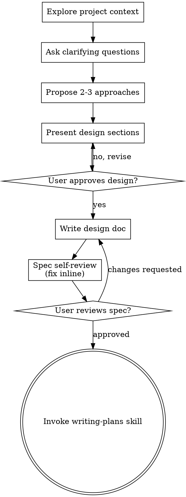
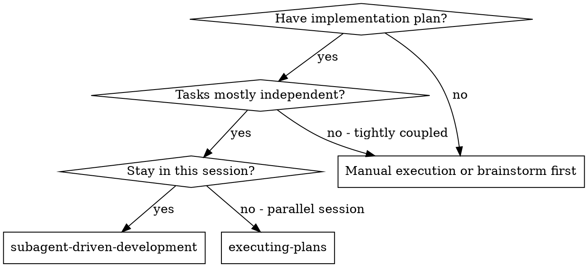
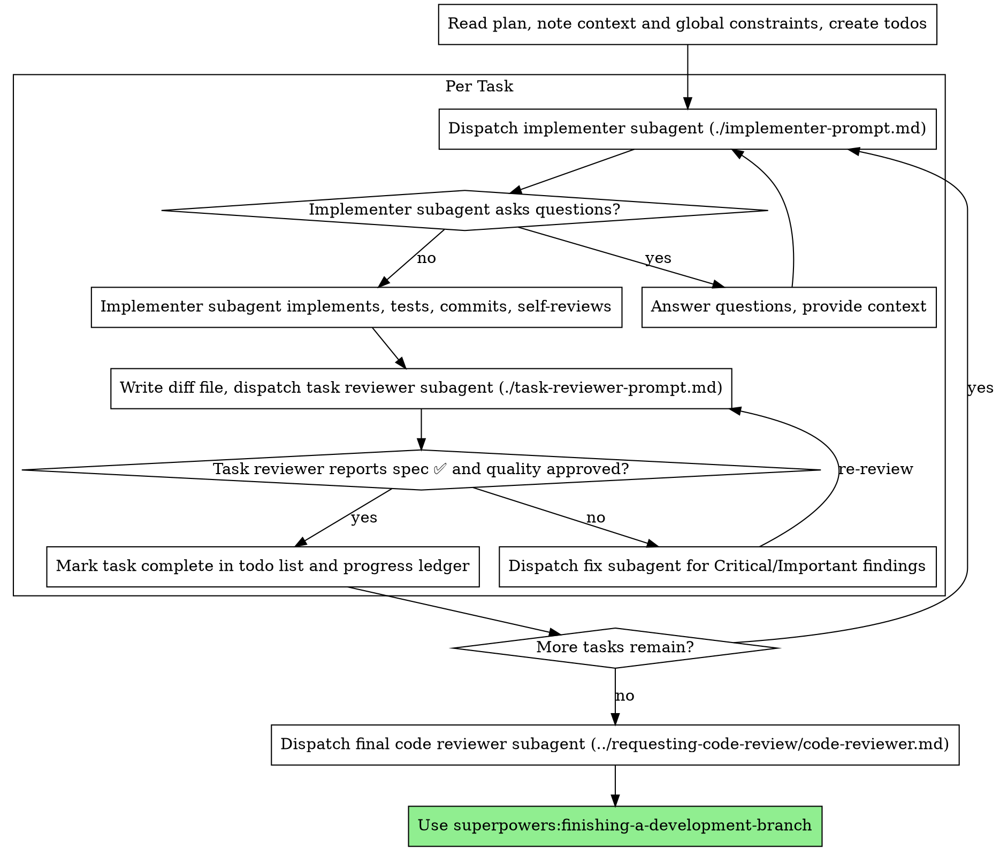

# Recall History — company-map


## Session 7a87a041 — 2026-07-17 22:57

**You:** <local-command-caveat>Caveat: The messages below were generated by the user while running local commands. DO NOT respond to these messages or otherwise consider them in your response unless the user explicitly asks you to.</local-command-caveat>

**You:** 삼성증권, NH투자긍권, NH투자증권우 , 한국금융지주, 한국금융지주우 배당, 자사주, 실적 모두 교해줘

**Claude:** 증권주 5종목(삼성증권, NH투자증권/우, 한국금융지주/우)의 배당·자사주·실적 비교 요청이시군요. company-map에 이미 DART 연동이 있으니, 그 파이프라인으로 DART 공시 데이터를 직접 조회해서 비교 보고서를 만들겠습니다. 먼저 기존 DART lib 구조와 API 키를 확인합니다.
  - `Bash: ls /Users/dijer/dev/workspace/fullstack-turborepo-starter/apps/company-map/src/lib/dart/`
  - `Bash: grep -l "DART_API_KEY\|dartApiKey" /Users/dijer/dev/workspace/fullstack-turborepo-starter/apps/company-map/.env.local /Users/dijer/dev/workspace/fullstack-turbo`
  - `Read: /Users/dijer/dev/workspace/fullstack-turborepo-starter/apps/company-map/src/lib/dart/alotMatter.ts`
  - `Read: /Users/dijer/dev/workspace/fullstack-turborepo-starter/apps/company-map/src/lib/dart/corp-code.ts`
  - `Read: /Users/dijer/dev/workspace/fullstack-turborepo-starter/apps/company-map/src/lib/dart/treasury-detail.ts`
  - `Read: /Users/dijer/dev/workspace/fullstack-turborepo-starter/apps/company-map/src/lib/dart/financial.ts`
  - `Read: /Users/dijer/dev/workspace/fullstack-turborepo-starter/apps/company-map/src/lib/dart/list.ts`
  - `Bash: ls /Users/dijer/dev/workspace/fullstack-turborepo-starter/apps/company-map/scripts/ | head -30`
  - `Bash: head -30 /Users/dijer/dev/workspace/fullstack-turborepo-starter/apps/company-map/scripts/smoke-dart.ts; echo ---; grep -n '"worker"\|tsx\|dotenv' /Users/dijer/d`
  - `Bash: ls /Users/dijer/dev/workspace/fullstack-turborepo-starter/apps/company-map/src/lib/stocks/ | head -30; echo ---; grep -rn "polling.finance.naver\|m.stock.naver.`
  - `Bash: sed -n 1,60p /Users/dijer/dev/workspace/fullstack-turborepo-starter/apps/company-map/src/lib/stocks/price-history.ts`
  - `Write: /private/tmp/claude-501/-Users-dijer-dev-workspace-fullstack-turborepo-starter/7a87a041-355d-4102-b837-8248bff8f115/scratchpad/collect-broker-compare.ts`
  - `Bash: cd /Users/dijer/dev/workspace/fullstack-turborepo-starter/apps/company-map && DART_API_KEY=$(grep '^DART_API_KEY=' .env.local | cut -d= -f2- | tr -d '"') npx ts`
  - `Bash: cd /private/tmp/claude-501/-Users-dijer-dev-workspace-fullstack-turborepo-starter/7a87a041-355d-4102-b837-8248bff8f115/scratchpad && python3 -c " import json d`
  - `Bash: cd /private/tmp/claude-501/-Users-dijer-dev-workspace-fullstack-turborepo-starter/7a87a041-355d-4102-b837-8248bff8f115/scratchpad && python3 -c " import json d`
  - `Bash: cd /Users/dijer/dev/workspace/fullstack-turborepo-starter/apps/company-map && KEY=$(grep '^DART_API_KEY=' .env.local | cut -d= -f2- | tr -d '"') && curl -s "htt`
  - `Write: /private/tmp/claude-501/-Users-dijer-dev-workspace-fullstack-turborepo-starter/7a87a041-355d-4102-b837-8248bff8f115/scratchpad/patch-broker-compare.ts`
  - `Bash: DART_API_KEY=$(grep '^DART_API_KEY=' .env.local | cut -d= -f2- | tr -d '"') npx tsx /private/tmp/claude-501/-Users-dijer-dev-workspace-fullstack-turborepo-start`
  - `Bash: cd /private/tmp/claude-501/-Users-dijer-dev-workspace-fullstack-turborepo-starter/7a87a041-355d-4102-b837-8248bff8f115/scratchpad && python3 << 'EOF' import jso`
  - `Bash: cd /private/tmp/claude-501/-Users-dijer-dev-workspace-fullstack-turborepo-starter/7a87a041-355d-4102-b837-8248bff8f115/scratchpad && python3 << 'EOF' import jso`
  - `Bash: cd /private/tmp/claude-501/-Users-dijer-dev-workspace-fullstack-turborepo-starter/7a87a041-355d-4102-b837-8248bff8f115/scratchpad && python3 -c " import json d`
  - `Bash: cd /private/tmp/claude-501/-Users-dijer-dev-workspace-fullstack-turborepo-starter/7a87a041-355d-4102-b837-8248bff8f115/scratchpad && python3 -c " import json d`
  - `Bash: cd /Users/dijer/dev/workspace/fullstack-turborepo-starter/apps/company-map && DART_API_KEY=$(grep '^DART_API_KEY=' .env.local | cut -d= -f2- | tr -d '"') npx ts`
  - `Bash: KEY=$(grep '^DART_API_KEY=' .env.local | cut -d= -f2- | tr -d '"') && for pair in "00120182 2024" "00432102 2024" "00432102 2023"; do set -- $pair; echo "=== co`

**Claude:** zsh 배열 분리 문제로 실패했습니다. 개별 호출로 다시 실행합니다.
  - `Bash: KEY=$(grep '^DART_API_KEY=' .env.local | cut -d= -f2- | tr -d '"') && fetch_tesstk() { echo "=== corp=$1 year=$2 ===" curl -s "https://opendart.fss.or.kr/api/te`
  - `Write: /Users/dijer/dev/workspace/fullstack-turborepo-starter/docs/brokers-dividend-treasury-earnings-2026-07-14.html`
  - `Bash: KEY=$(grep '^DART_API_KEY=' .env.local | cut -d= -f2- | tr -d '"') && for corp in 00104856 00120182 00432102; do echo "=== $corp ==="; curl -s "https://opendart`
  - `Edit: /Users/dijer/dev/workspace/fullstack-turborepo-starter/docs/brokers-dividend-treasury-earnings-2026-07-14.html`
  - `Bash: open /Users/dijer/dev/workspace/fullstack-turborepo-starter/docs/brokers-dividend-treasury-earnings-2026-07-14.html`

**Claude:** 비교 완료했습니다. DART 공시(FY2023~2025 사업보고서 + 2026년 1분기보고서)와 네이버 현재가 기준으로 정리했고, 보고서를 브라우저로 열어드렸습니다.

**보고서**: `/Users/dijer/dev/workspace/fullstack-turborepo-starter/docs/brokers-dividend-treasury-earnings-2026-07-14.html`

핵심 요약:

| | 삼성증권 | NH투자증권 (우) | 한국금융지주 (우) |
|---|---|---|---|
| FY2025 순이익 | 1조 72억 (+12%) | 1조 315억 (+50%) | **2조 244억 (+94%)** |
| 2026 Q1 순이익 YoY | +81.5% | **+128.5%** | +99.6% |
| FY2025 DPS | 4,000원 | 1,300원 (우 1,350원) | 8,690원 (우 8,752원) |
| 현재가 기준 배당수익률 | 3.68% | 4.17% (우 **5.49%**) | 3.67% (우 **5.59%**) |
| 배당성향 | 35.5% (3년 고정) | **47.3%** | 25.1% (매년 상승 중) |
| 자사주 | 0주, 이력 없음 | **매년 500억 매입→전량 소각** (2년간 약 2.1% 소각) | 보통주 **5.36%** 보유, 3년째 변동 0 |

관전 포인트:

- **주주환원의 양은 NH투자증권** — 배당성향 47%에 유일한 소각 프로그램(2024년 417만주, 2025년 341만주 전량 소각)을 더해 총환원율 약 52%.
- **이익의 질과 밸류에이션은 한국금융지주** — 순익 2조 돌파, ROE 16.7%, PER 6.9배로 3사 중 가장 쌈. 다만 배당성향은 25%로 인색하고, FY2025 급증(영업이익 +95%)의 상당 부분이 금융상품 트레이딩 손익(3,003억→1조 1,982억)이라 변동성이 큰 구조. 자사주 5.36%는 소각하면 즉시 주주가치가 개선되는 잠재 카드지만 실행 공시는 없음.
- **예측 가능성은 삼성증권** — 성향 35%를 3년째 기계적으로 유지하는 이익연동 배당. 대신 자사주 환원은 전무.
- **우선주 2종은 수익률 면에서 우위** — 배당금 차이는 +50~62원으로 미미하지만 주가 할인(NH우 21%, 한금우 34%) 덕에 수익률이 보통주보다 1.3~1.9%p 높습니다.
- **배당 기준일 방식 차이 주의** — 삼성증권은 12월 말 기준일(구방식), NH(3월)·한금지주(2월)는 배당액 확정 후 기준일을 정하는 방식이라 배당을 받기 위한 매수 시점이 서로 다릅니다.

참고: 시가배당률·배당성향은 DART 결산 공시값이고, "현재가 기준 수익률"은 FY2025 배당금을 오늘 종가로 나눈 값(미래 배당 보장 아님)입니다.

**You:** 라오어의 vr 5.0 숙지해줘

**Claude:** 무한매수법 V4.0 작업에 이어 라오어 VR(밸류 리밸런싱) 5.0을 파악해 달라는 요청이군요. 마침 지난 7월 9일에 만든 VR 관련 분석 문서 3개가 `docs/`에 있으니, 먼저 그것부터 확인하고 부족한 부분은 웹에서 보강하겠습니다.
  - `Bash: ls -la /Users/dijer/dev/workspace/fullstack-turborepo-starter/docs/*vr* /Users/dijer/dev/workspace/fullstack-turborepo-starter/docs/*laofus* 2>/dev/null; echo -`

**Claude:** 세 문서 모두 5.0을 언급합니다. 텍스트를 추출해 읽어보겠습니다.
  - `Bash: cd /Users/dijer/dev/workspace/fullstack-turborepo-starter/docs && python3 << 'EOF' import re, html def extract(path): src = open(path, encoding='utf-8').read()`
  - `Bash: python3 << 'EOF' import re, html def extract(path): src = open(path, encoding='utf-8').read() src = re.sub(r'<(style|script)[^>]*>.*?</\1>', '', src, flags=re.S`
  - `Bash: python3 << 'EOF' import re, html def extract(path): src = open(path, encoding='utf-8').read() src = re.sub(r'<(style|script)[^>]*>.*?</\1>', '', src, flags=re.S`
  - `Bash: ls /Users/dijer/dev/workspace/fullstack-turborepo-starter/.recall/ /Users/dijer/dev/workspace/fullstack-turborepo-starter/docs/.recall/ 2>/dev/null; echo ---; g`
  - `Write: /Users/dijer/.claude/projects/-Users-dijer-dev-workspace-fullstack-turborepo-starter/memory/vr-5.0-rules.md`
  - `Read: /Users/dijer/.claude/projects/-Users-dijer-dev-workspace-fullstack-turborepo-starter/memory/MEMORY.md`
  - `Edit: /Users/dijer/.claude/projects/-Users-dijer-dev-workspace-fullstack-turborepo-starter/memory/MEMORY.md`

**Claude:** VR 5.0 숙지 완료했습니다. 지난 7월 9일 세션에서 카페 원문 기반으로 정리해 둔 `docs/vr-value-rebalancing-flow-2026-07-09.html`(방법론)과 재생목록 분석 문서 2개를 모두 읽었고, 핵심 규칙을 영구 메모리(`vr-5.0-rules.md`)에 저장해서 다음 세션부터는 바로 이 맥락 위에서 작업할 수 있습니다.

숙지한 내용 요약:

**VR 5.0 = 목표가치 추종형 TQQQ 장기 운용법** (2022-04-15 공개, 무한매수법과는 완전히 별개 전략)

- **구성요소**: V(목표가치) · Pool(예수금) · G(기울기 — 적립·거치식 10, 인출식 20) · 밴드(V×0.85~1.15) · 2주 사이클
- **사이클 절차**: 적립 반영 → V 갱신(`다음V = 현재V + Pool÷G + 적립금`) → 밴드를 보유 주수로 나눠 매수점·매도점 산출 → 2주치 **LOC 주문**을 미리 걸어둠 → 종가 기준 평가금이 상단 돌파하면 초과분 매도(→Pool), 하단 이탈하면 부족분 매수(Pool 한도 내), 밴드 안이면 대기. 시황 판단·장중 대응이 전혀 없는 것이 핵심.
- **실력공식**(62주차~): 긴 하락장에서 Pool이 마르면 기본공식은 V가 수평이 되는 한계 → 실력공식은 V를 함께 하락시켜 매도점을 앞당기고 Pool을 조기 회복.
- **매수 브레이크(Pool 사용한도)**: 적립식 75%에서 시작해 26주마다 5%p씩 축소, 338주차부터 10% 고정. 거치식 50%, 인출식 10~25%. 계좌가 커진 뒤의 리먼급 폭락 대비 장치.
- **실전 현황**(2026-07 기준): 적립식 VR 1기 270주차+(236주차에 G 10→15 상향), 거치식 VR 2기 2026년 5월 목표 달성, 인출식은 2025년 6월 실전 시작 — "돈을 빼면서 평생 운용"이 최종 그림.

한 가지 알려진 공백: **실력공식의 정확한 수식은 미확보**입니다(책·영상·엑셀로만 공개). 나중에 company-map에 VR 5.0을 구현하게 되면 이 부분만 원자료 확보가 필요하고, 그 외 규칙은 구현 가능한 수준으로 파악돼 있습니다.

**You:** 녕하세요 라오어입니다

​

밸류리밸런싱 책에서 후반부에 소개될 내용이기도 한,

실력공식을 소개하기에 앞서 

​

기존의 기본공식과 차이점에 대해서 먼저 설명드리고자 합니다

​

참고로 밸류리밸런싱 _ " 기본공식 " 편은 10억만들기 유튜브로 소개드린 바와 같습니다

​


기본공식

​

​

실력공식에 대한 아이디어나 백테스트 등은 이미 몇주전에 어느정도 정리가 되어있었으나

​

기본공식에 먼저 적응을 하는 시간을 드리고 싶어서

공개시기를 조금 늦춘 상황입니다.

​

이제 기본공식의 개념에 대해 어느정도 받아들이셨을 것 같아서, 기본공식의 장점과 한계에 대해 설명드리고자 합니다

​

장점

무엇보다 공식이 매우 간단하다는 점이 가장 큰 장점이라고 생각합니다. 공식자체가 간단하기도 하고, 공식을 이해하는 난이도도 쉽습니다. 특히 상승률에 대한 개념, 즉 pool 이 늘어나면 더 공격적인 매수를 의도하고 pool 이 줄어들면 더 공격적인 매도를 의도한다는 부분을 이해하셨다면 거의다 이해한 것입니다.

​

거기에 G 값을 통해 상승률을 본인 스타일에 따라 조절할 수 있기때문에, 각자 커스텀화 시키기도 쉽습니다.

​

한계

하락장이 길게 이어질경우 사실상 존버나 단순 적립식매수와 크게 다르지 않습니다. 이는 공식이 간단하기때문에 어쩔수없이 반영할 수 없는 부분이기도 합니다.  TQQQ 의 하락부분을 분할매수 한 뒤의 존버이기때문에, 고점존버보다는 낫긴 합니다만

​

pool 이 사실상 제로에 가깝게 된 이후부터는 V 는 거의 평행하게 되는데, 논리적으로 아쉬운 부분이 있었습니다. 이런 부분을 책이 나오기전에 해결하고 싶었습니다

​


​

​

​

​

​

​

​

이제부터 이 한계를 반영한 실력공식편 소개입니다

​

​

특징

앞서 기본공식에서는 pool 이 제로에 가까우면 V 기울기는 평행상태가 되지만, 실력공식에서는 V가 내려갑니다

​


​

즉 하락장 또는 상승장을 조금더 빠르게 반영하는 특징이 있어서 그렇습니다.

​

수학적으로도 논리적으로도 저는 V 가 하락장에 내려가야한다고 생각합니다. 설령 백테스트상 결과가 조금더 안좋아진다고 하더라도 말입니다.

​

따라서 처음에 공식을 만들때는 백테스트를 하지 않고 진행했습니다. 수학적으로 논리를 먼저 생각하고 노트에 공식을 정리하면서 만들어 갔습니다. 공식을 만든 과정은 추후 책으로 기술할 예정입니다.

​


​

그리고 공식을 정립하고 난 다음에 백테스트를 하면서 여러가지 재미있는 현상들을 나중에 발견하게 되었는데, 이부분도 글로 표현하기 너무 길어서 책으로 기술하였습니다

​

결론적으로는 백테스트상 기본공식편에 비해 성능이 떨어지지 않는 것으로 확인하였습니다

​

단점

단점은 공식이 복잡합니다

​

복잡한 공식은 이번주 안으로 정리해서 카페에 글로 적도록 하겠습니다.

​

확인해야할 변수가 더 많아졌고, 공학계산기나 엑셀을 쓰지 않고는 계산을 직접할 수 없습니다.

​

그래도 이때까지 60주가 진행되어온 유튜브를 보셨다면 또 금방 적응할 수 있으시리라 생각합니다.

​

​

​

​

​

사실 기본공식으로만 쭉 밀고나가셔도 크게 상관은 없습니다. 성향상 기본공식을 더 선호하는 분이 있을수 있습니다.

​

​

제가 왜 "성향상" 이라는 단어를 적었는지 설명드리면

​

실력공식은 하락장에서 V 값이 내려가기때문에, 기본공식보다 매도점이 훨씬 빨리 옵니다.

​

하지만 그 매도점이 빨리 오다못해 평단보다 더 낮은 지점에서 매도가 될수도 있습니다.

​

​

저는 설령 그런 일이 발생한다고 하더라도 수학적으로는 실력공식 쪽이 더 논리에 부합한다고 생각하지만, 성향상 빠른매도를 선호하지 않을 수도 있습니다. 

​

반대로 손절이라 할지라도 현금보유를 더 선호하시는 분도 계실 수 있습니다. 빠른 매도로 풀을 확보하고 VR을 이어나갈 수 있으니까요

​

​

따라서 성향에따라 기본공식으로만 쭉 이어가셔도 상관없다고 생각합니다. 어차피 우리는 9년뒤에 어느지점에서 만날 것이고 백테스트상 기본공식과 실력공식은 수익률 MDD 가 크게 차이나지 않습니다.

​

​

​

다만 저는 제 성향상 더 논리적인 것을 선호하는 지라서, 10억만들기 62주차 영상부터는 실력공식 으로 진행하도록 하겠습니다

​

​

수정)

​

실력공식을 유튜브를 통해 공개하였습니다

**Claude:** 라오어의 2022-06-07 카페 글("실력공식을 소개하기에 앞서")이군요 — 지난번 flow 문서에서 출처로 인용했던 바로 그 글입니다. 내용을 흡수했고, 글 말미에 "실력공식을 유튜브를 통해 공개하였습니다"라고 되어 있으니 실제 수식이 텍스트로 공개된 후속 자료가 있는지 웹에서 찾아보겠습니다.
  - `ToolSearch: select:WebSearch,WebFetch`
  - `WebSearch: 라오어 밸류리밸런싱 실력공식 V값 공식 정리`

**Claude:** 공식 수식은 검색 요약에 없네요. 더 구체적으로 검색해 보겠습니다.
  - `WebSearch: "실력공식" 밸류리밸런싱 VR 수식 엑셀 계산 블로그`

**Claude:** TheoryDB 서평이 책 내용을 상세히 다룰 수 있으니 확인해 보겠습니다.
  - `WebFetch: https://theorydb.github.io/review/2022/10/15/review-book-value-rebalancing/`
  - `WebSearch: 밸류리밸런싱 VR 계산기 실력공식 V값 계산 사이트`
  - `Edit: /Users/dijer/.claude/projects/-Users-dijer-dev-workspace-fullstack-turborepo-starter/memory/vr-5.0-rules.md`

**Claude:** 글 내용 숙지했고 메모리에 반영했습니다. 이 글은 지난번 flow 문서에서 출처로 인용했던 2022-06-07 카페 글("실력공식을 소개하기에 앞서") 원문이네요. 새로 확정된 내용은 이렇습니다:

**이 글에서 확인·보강된 것**

- **기본공식의 한계**: Pool이 0에 가까워지면 V가 평행 → 긴 하락장에선 사실상 "분할매수 후 존버"와 동일 (고점 존버보단 낫지만).
- **실력공식의 핵심 차이**: Pool이 말라도 V가 **내려간다** → 시장을 더 빨리 반영, 매도점이 훨씬 일찍 오고 **평단 아래 매도(손절성 매도)도 발생 가능** — 대신 Pool을 빨리 회복해 VR을 이어갈 수 있음.
- **설계 철학**: 백테스트 없이 수학적 논리 우선으로 먼저 만들었고, 사후 백테스트에서 수익률·MDD 모두 기본공식과 대등 확인.
- **선택은 성향 문제**: 빠른 매도(현금 확보)를 선호하면 실력공식, 싫으면 기본공식 유지도 무방 — 장기적으로 두 공식은 수렴. 라오어 본인은 62주차부터 실력공식 적용.

**남은 공백 하나**: 이 글은 실력공식의 "소개 예고편"이라 **실제 수식은 여기에 없습니다**. 글 본문에 "복잡한 공식은 이번주 안으로 카페에 글로 정리하겠다", 말미 수정에 "유튜브를 통해 공개했다"고 되어 있으니 수식 정리본은 ① 후속 카페 글, ② 유튜브 공개 영상, ③ 책 PART 7(실력공식편)에 있습니다. 공개 웹(블로그·서평)에는 수식 재현본이 없는 것을 방금 검색으로 확인했습니다 — [TheoryDB 서평](https://theorydb.github.io/review/2022/10/15/review-book-value-rebalancing/)도 "책 원문 참조"로만 안내하고, [교보문고 책 소개](https://product.kyobobook.co.kr/detail/S000061695672)로 목차만 확인됩니다.

카페 접근 권한은 사용자님께 있으니, **후속 카페 글(실력공식 수식 정리본)을 지금처럼 붙여넣어 주시면** 수식까지 완전히 숙지해서 메모리에 반영하겠습니다. 나중에 company-map에 VR을 구현할 때는 그 수식이 반드시 필요합니다.

Sources: [TheoryDB — 라오어의 미국주식 밸류 리밸런싱 리뷰](https://theorydb.github.io/review/2022/10/15/review-book-value-rebalancing/), [교보문고 — 라오어의 미국주식 밸류 리밸런싱](https://product.kyobobook.co.kr/detail/S000061695672)

**You:** https://www.youtube.com/watch?v=cIp8G3AVtnM&t=2s 이 유투브도 참고해줘

**Claude:** 그 영상(아마 실력공식 공개 영상)을 확인해 보겠습니다. 먼저 영상 정보를 가져오고, 자막 추출이 가능한지 로컬 도구도 확인합니다.
  - `WebFetch: https://www.youtube.com/watch?v=cIp8G3AVtnM`
  - `Bash: which yt-dlp youtube-dl 2>/dev/null; yt-dlp --version 2>/dev/null; echo "---"; which ffmpeg 2>/dev/null`
  - `Bash: cd /private/tmp/claude-501/-Users-dijer-dev-workspace-fullstack-turborepo-starter/7a87a041-355d-4102-b837-8248bff8f115/scratchpad && python3 -m venv ytvenv && .`
  - `Bash: cd /private/tmp/claude-501/-Users-dijer-dev-workspace-fullstack-turborepo-starter/7a87a041-355d-4102-b837-8248bff8f115/scratchpad && ./ytvenv/bin/yt-dlp --write`

**Claude:** macOS 파이썬의 인증서 문제입니다. certifi를 설치해 해결합니다.
  - `Bash: cd /private/tmp/claude-501/-Users-dijer-dev-workspace-fullstack-turborepo-starter/7a87a041-355d-4102-b837-8248bff8f115/scratchpad && ./ytvenv/bin/pip -q install`
  - `Bash: cd /private/tmp/claude-501/-Users-dijer-dev-workspace-fullstack-turborepo-starter/7a87a041-355d-4102-b837-8248bff8f115/scratchpad && ./ytvenv/bin/pip -q install`
  - `Bash: cd /private/tmp/claude-501/-Users-dijer-dev-workspace-fullstack-turborepo-starter/7a87a041-355d-4102-b837-8248bff8f115/scratchpad && export SSL_CERT_FILE=$(./yt`

**Claude:** player client 우회는 실패. `youtube-transcript-api` 패키지로 다른 경로를 시도합니다.
  - `Bash: cd /private/tmp/claude-501/-Users-dijer-dev-workspace-fullstack-turborepo-starter/7a87a041-355d-4102-b837-8248bff8f115/scratchpad && ./ytvenv/bin/pip -q install`
  - `Bash: cd /private/tmp/claude-501/-Users-dijer-dev-workspace-fullstack-turborepo-starter/7a87a041-355d-4102-b837-8248bff8f115/scratchpad && export SSL_CERT_FILE=$(./yt`
  - `Read: /private/tmp/claude-501/-Users-dijer-dev-workspace-fullstack-turborepo-starter/7a87a041-355d-4102-b837-8248bff8f115/scratchpad/vr62-en.txt`
  - `Bash: cd /private/tmp/claude-501/-Users-dijer-dev-workspace-fullstack-turborepo-starter/7a87a041-355d-4102-b837-8248bff8f115/scratchpad && export SSL_CERT_FILE=$(./yt`

**Claude:** 2분 36초 영상입니다. 장면 전환 프레임을 추출합니다.
  - `Bash: cd /private/tmp/claude-501/-Users-dijer-dev-workspace-fullstack-turborepo-starter/7a87a041-355d-4102-b837-8248bff8f115/scratchpad && mkdir -p frames && ffmpeg -`
  - `Bash: cd /private/tmp/claude-501/-Users-dijer-dev-workspace-fullstack-turborepo-starter/7a87a041-355d-4102-b837-8248bff8f115/scratchpad && rm -f frames/*.png && ffmpe`
  - `Read: /private/tmp/claude-501/-Users-dijer-dev-workspace-fullstack-turborepo-starter/7a87a041-355d-4102-b837-8248bff8f115/scratchpad/sheet_1.png`
  - `Read: /private/tmp/claude-501/-Users-dijer-dev-workspace-fullstack-turborepo-starter/7a87a041-355d-4102-b837-8248bff8f115/scratchpad/sheet_2.png`
  - `Bash: ls /private/tmp/claude-501/-Users-dijer-dev-workspace-fullstack-turborepo-starter/7a87a041-355d-4102-b837-8248bff8f115/scratchpad/frames/`
  - `Read: /private/tmp/claude-501/-Users-dijer-dev-workspace-fullstack-turborepo-starter/7a87a041-355d-4102-b837-8248bff8f115/scratchpad/frames/f_016.png`
  - `Edit: /Users/dijer/.claude/projects/-Users-dijer-dev-workspace-fullstack-turborepo-starter/memory/vr-5.0-rules.md`
  - `Edit: /Users/dijer/.claude/projects/-Users-dijer-dev-workspace-fullstack-turborepo-starter/memory/MEMORY.md`
  - `Bash: grep -n "실력공식\|복잡한 공식" /Users/dijer/dev/workspace/fullstack-turborepo-starter/docs/vr-value-rebalancing-flow-2026-07-09.html | head`
  - `Read: /Users/dijer/dev/workspace/fullstack-turborepo-starter/docs/vr-value-rebalancing-flow-2026-07-09.html`
  - `Edit: /Users/dijer/dev/workspace/fullstack-turborepo-starter/docs/vr-value-rebalancing-flow-2026-07-09.html`
  - `Edit: /Users/dijer/dev/workspace/fullstack-turborepo-starter/docs/vr-value-rebalancing-flow-2026-07-09.html`

**Claude:** 62주차 영상 숙지 완료했습니다. 음성이 없는 슬라이드 영상이라 자막 대신 **영상을 내려받아 슬라이드 프레임을 직접 읽었고**, 그동안 미확보였던 실력공식 수식을 확보했습니다.

**실력공식 (62주차 슬라이드 원문)**

```
V₂ = V₁ + Pool/G + (E − V₁)/(2√G) ± (적립금 or 인출금)
```
- E = 마지막 평가금(주식 평가액), V₁ = 직전 V
- 기본공식과의 차이는 `(E − V₁)/(2√G)` 항 하나입니다. 평가금이 V보다 낮으면(하락장) 이 항이 음수가 되어 V를 끌어내리고, 높으면 V를 가속시킵니다. E ≈ V이면 기본공식과 사실상 동일 — 카페 글에서 설명한 "Pool이 말라도 V가 내려간다"가 수식으로 확인됩니다.
- **62주차 실계산 검증**: V₁ 15205.76, E 5282.11, Pool 76.73, G 11, 적립 250 → 새V = 15205.76 + 6.98 − 1496.05 + 250 = **13966.69** (제가 재계산해도 일치). 밴드는 ×0.85 = 11871.69 / ×1.15 = 16061.69로 ±15% 규칙 그대로.

**영상에서 추가로 확인된 실전 디테일**

- **G가 62주차에 이미 11** — 시작값 10에서 점진 상향되고 있었습니다. "236주차에 10→15"라고 알고 있던 것은 단번이 아니라 단계적 상향의 일부로 보입니다.
- **매수표·매도표 작성법**: 보유 개수를 1주씩 늘리며(233→234→…) 각 개수에서의 매수점 주가와 Pool 잔액을 표로 만들고, 2주치 지정가 예약매수를 겁니다. 매도는 상단 가격대(69.23~)마다 2개씩 지정가.
- **Pool 75% 한도의 실전 적용**: 갭 하락으로 예약매수가 안 걸리는 구간이 생기자 "Pool의 75% 근처를 사용하기 위해 시초가 시장가매수 10개"로 보정 — 한도를 채우는 쪽으로 운용.
- 당시 계좌는 원금 12,750\$ 대비 **수익률 −56%**(2022년 바닥 부근)였는데도 공식대로 기계적 실행 — 이후 2024년에 +68%까지 회복한 그 계좌입니다.

**반영한 곳**

- 메모리 `vr-5.0-rules.md` — 수식·검산 예시·운영 디테일 추가 (이제 "수식 미확보" 공백 해소)
- `docs/vr-value-rebalancing-flow-2026-07-09.html` — §3 실력공식 카드에 수식과 62주차 실례 삽입, 출처에 영상 링크 추가

이로써 VR 5.0은 기본공식·실력공식 모두 **구현 가능한 수준**으로 숙지됐습니다. company-map에 VR 시뮬레이터나 자동화가 필요하면 말씀 주세요.

**You:** 기본공식과 실력 공식이 어떤 차이가 있나?

**Claude:** 두 공식의 차이는 **항 하나**지만, 하락장에서의 행동이 완전히 달라집니다.

**수식**

| | 공식 |
|---|---|
| 기본공식 | V₂ = V₁ + Pool/G + 적립금 |
| 실력공식 | V₂ = V₁ + Pool/G + **(E − V₁)/(2√G)** + 적립금 |

추가된 항의 E는 마지막 평가금(주식 평가액)입니다. 즉 기본공식은 **시장이 어떻든 V가 Pool과 적립금만으로 결정**되는 반면(단조 상승, Pool이 마르면 수평), 실력공식은 **"실제 계좌가 목표에서 얼마나 벗어났나"를 피드백으로 반영**합니다. 평가금이 V보다 낮으면 그 괴리의 약 1/(2√G)만큼 V를 끌어내리고, 높으면 반대로 가속시킵니다. 평가금이 V 근처면 두 공식은 사실상 같습니다 — 갈리는 건 괴리가 벌어진 극단 국면뿐입니다.

**하락장에서 뭐가 달라지나 (62주차 실측 대비)**

2022년 바닥에서 V₁ 15205.76, 평가금 E 5282.11, Pool 76.73, G 11이었을 때:

- 기본공식이었다면: 새V = 15205.76 + 6.98 + 250 = **15462.74** — V는 계속 오르기만 하고, 평가금(5282)과의 괴리는 3배로 벌어진 채 유지됩니다. Pool도 없으니 매수도 못 하고, 매도선(V×1.15 ≈ 17,782)은 아득히 멀어 **사실상 "분할매수 끝난 존버"**가 됩니다.
- 실력공식 실제: 새V = 15205.76 + 6.98 **− 1496.05** + 250 = **13966.69** — V가 매 사이클 괴리의 약 15%씩 시장 쪽으로 내려옵니다. V가 내려오면 매도선도 함께 내려와, 반등이 오면 **매도가 훨씬 일찍 발동**됩니다. 그 매도가 평단보다 낮은 가격(손절성 매도)일 수도 있지만, 그렇게 확보한 현금이 Pool을 채워 **리밸런싱 사이클이 다시 돌아갑니다**. 이게 라오어가 말한 "폭락기에도 밸류 리밸런싱을 계속한다"의 실체입니다.

상승장에서는 반대로 E > V가 되면 V가 더 가파르게 따라 올라가서, 매도선이 같이 올라가 이익 실현이 과하게 일찍 나오는 걸 완화합니다 — 양방향 모두 "시장을 더 빨리 반영"하는 겁니다.

**트레이드오프**

- 백테스트 성능(수익률·MDD)은 **대등**합니다. 라오어 본인도 "성향 문제"라고 못박았습니다 — 평단 아래 매도를 감수하고 현금 회복·논리적 정합성을 택할 거냐(실력공식), 손절 없는 단순함을 택할 거냐(기본공식).
- 실무 난이도: 기본공식은 암산 수준, 실력공식은 √G 때문에 계산기·엑셀이 필요하고 매 사이클 확인할 변수(E)가 하나 늘어납니다.
- 라오어는 62주차(2022-06)부터 실력공식으로 전환해 지금까지 운용 중입니다.

한 줄로: **기본공식은 "목표는 절대 안 내려간다"는 고집형, 실력공식은 "목표도 현실을 인정하되 그만큼 빨리 회복한다"는 피드백형**입니다.

**You:** company-map에 VR 5.0 구현 계획 세워줘

**Claude:** 구현 계획 요청이니, 먼저 superpowers:brainstorming 스킬로 요구사항·설계를 정리한 뒤 계획을 세우겠습니다.
  - `Skill: superpowers:brainstorming`

**You:** Base directory for this skill: /Users/dijer/.claude/plugins/cache/claude-plugins-official/superpowers/6.1.1/skills/brainstorming

# Brainstorming Ideas Into Designs

Help turn ideas into fully formed designs and specs through natural collaborative dialogue.

Start by understanding the current project context, then ask questions one at a time to refine the idea. Once you understand what you're building, present the design and get user approval.

<HARD-GATE>
Do NOT invoke any implementation skill, write any code, scaffold any project, or take any implementation action until you have presented a design and the user has approved it. This applies to EVERY project regardless of perceived simplicity.
</HARD-GATE>

## Anti-Pattern: "This Is Too Simple To Need A Design"

Every project goes through this process. A todo list, a single-function utility, a config change — all of them. "Simple" projects are where unexamined assumptions cause the most wasted work. The design can be short (a few sentences for truly simple projects), but you MUST present it and get approval.

## Checklist

You MUST create a task for each of these items and complete them in order:

1. **Explore project context** — check files, docs, recent commits
2. **Offer the visual companion just-in-time** — NOT upfront. The first time a question would genuinely be clearer shown than described, offer it then (its own message); on approval its browser tab opens for you. If no visual question ever arises, never offer it. See the Visual Companion section below.
3. **Ask clarifying questions** — one at a time, understand purpose/constraints/success criteria
4. **Propose 2-3 approaches** — with trade-offs and your recommendation
5. **Present design** — in sections scaled to their complexity, get user approval after each section
6. **Write design doc** — save to `docs/superpowers/specs/YYYY-MM-DD-<topic>-design.md` and commit
7. **Spec self-review** — quick inline check for placeholders, contradictions, ambiguity, scope (see below)
8. **User reviews written spec** — ask user to review the spec file before proceeding
9. **Transition to implementation** — invoke writing-plans skill to create implementation plan

## Process Flow



**The terminal state is invoking writing-plans.** Do NOT invoke frontend-design, mcp-builder, or any other implementation skill. The ONLY skill you invoke after brainstorming is writing-plans.

## The Process

**Understanding the idea:**

- Check out the current project state first (files, docs, recent commits)
- Before asking detailed questions, assess scope: if the request describes multiple independent subsystems (e.g., "build a platform with chat, file storage, billing, and analytics"), flag this immediately. Don't spend questions refining details of a project that needs to be decomposed first.
- If the project is too large for a single spec, help the user decompose into sub-projects: what are the independent pieces, how do they relate, what order should they be built? Then brainstorm the first sub-project through the normal design flow. Each sub-project gets its own spec → plan → implementation cycle.
- For appropriately-scoped projects, ask questions one at a time to refine the idea
- Prefer multiple choice questions when possible, but open-ended is fine too
- Only one question per message - if a topic needs more exploration, break it into multiple questions
- Focus on understanding: purpose, constraints, success criteria

**Exploring approaches:**

- Propose 2-3 different approaches with trade-offs
- Present options conversationally with your recommendation and reasoning
- Lead with your recommended option and explain why

**Presenting the design:**

- Once you believe you understand what you're building, present the design
- Scale each section to its complexity: a few sentences if straightforward, up to 200-300 words if nuanced
- Ask after each section whether it looks right so far
- Cover: architecture, components, data flow, error handling, testing
- Be ready to go back and clarify if something doesn't make sense

**Design for isolation and clarity:**

- Break the system into smaller units that each have one clear purpose, communicate through well-defined interfaces, and can be understood and tested independently
- For each unit, you should be able to answer: what does it do, how do you use it, and what does it depend on?
- Can someone understand what a unit does without reading its internals? Can you change the internals without breaking consumers? If not, the boundaries need work.
- Smaller, well-bounded units are also easier for you to work with - you reason better about code you can hold in context at once, and your edits are more reliable when files are focused. When a file grows large, that's often a signal that it's doing too much.

**Working in existing codebases:**

- Explore the current structure before proposing changes. Follow existing patterns.
- Where existing code has problems that affect the work (e.g., a file that's grown too large, unclear boundaries, tangled responsibilities), include targeted improvements as part of the design - the way a good developer improves code they're working in.
- Don't propose unrelated refactoring. Stay focused on what serves the current goal.

## After the Design

**Documentation:**

- Write the validated design (spec) to `docs/superpowers/specs/YYYY-MM-DD-<topic>-design.md`
  - (User preferences for spec location override this default)
- Use elements-of-style:writing-clearly-and-concisely skill if available
- Commit the design document to git

**Spec Self-Review:**
After writing the spec document, look at it with fresh eyes:

1. **Placeholder scan:** Any "TBD", "TODO", incomplete sections, or vague requirements? Fix them.
2. **Internal consistency:** Do any sections contradict each other? Does the architecture match the feature descriptions?
3. **Scope check:** Is this focused enough for a single implementation plan, or does it need decomposition?
4. **Ambiguity check:** Could any requirement be interpreted two different ways? If so, pick one and make it explicit.

Fix any issues inline. No need to re-review — just fix and move on.

**User Review Gate:**
After the spec review loop passes, ask the user to review the written spec before proceeding:

> "Spec written and committed to `<path>`. Please review it and let me know if you want to make any changes before we start writing out the implementation plan."

Wait for the user's response. If they request changes, make them and re-run the spec review loop. Only proceed once the user approves.

**Implementation:**

- Invoke the writing-plans skill to create a detailed implementation plan
- Do NOT invoke any other skill. writing-plans is the next step.

## Key Principles

- **One question at a time** - Don't overwhelm with multiple questions
- **Multiple choice preferred** - Easier to answer than open-ended when possible
- **YAGNI ruthlessly** - Remove unnecessary features from all designs
- **Explore alternatives** - Always propose 2-3 approaches before settling
- **Incremental validation** - Present design, get approval before moving on
- **Be flexible** - Go back and clarify when something doesn't make sense

## Visual Companion

A browser-based companion for showing mockups, diagrams, and visual options during brainstorming. Available as a tool — not a mode. Accepting the companion means it's available for questions that benefit from visual treatment; it does NOT mean every question goes through the browser.

**Offering the companion (just-in-time):** Do NOT offer it upfront. Wait until a question would genuinely be clearer shown than told — a real mockup / layout / diagram question, not merely a UI *topic*. The first time that happens, offer it then, as its own message:
> "This next part might be easier if I show you — I can put together mockups, diagrams, and comparisons in a browser tab as we go. It's still new and can be token-intensive. Want me to? I'll open it for you."

**This offer MUST be its own message.** Only the offer — no clarifying question, summary, or other content. Wait for the user's response. If they accept, start the server with `--open` so their browser opens to the first screen automatically. If they decline, continue text-only and don't offer again unless they raise it.

**Per-question decision:** Even after the user accepts, decide FOR EACH QUESTION whether to use the browser or the terminal. The test: **would the user understand this better by seeing it than reading it?**

- **Use the browser** for content that IS visual — mockups, wireframes, layout comparisons, architecture diagrams, side-by-side visual designs
- **Use the terminal** for content that is text — requirements questions, conceptual choices, tradeoff lists, A/B/C/D text options, scope decisions

A question about a UI topic is not automatically a visual question. "What does personality mean in this context?" is a conceptual question — use the terminal. "Which wizard layout works better?" is a visual question — use the browser.

If they agree to the companion, read the detailed guide before proceeding:
`skills/brainstorming/visual-companion.md`


ARGUMENTS: company-map에 라오어 VR 5.0 (밸류리밸런싱) 구현 계획
  - `ToolSearch: select:TaskCreate,TaskUpdate`
  - `Bash: ls docs/superpowers/specs/ docs/superpowers/plans/ 2>/dev/null; echo ---; git log --oneline -15 -- apps/company-map | head -15; echo ---; find apps/company-map/`
  - `TaskCreate: 프로젝트 컨텍스트 탐색 (V4.0 선례·토스 API 제약)`
  - `TaskCreate: 요구사항 명확화 질문 (하나씩)`
  - `TaskCreate: 2-3개 접근안 제시 및 추천`
  - `TaskCreate: 설계 제시 및 승인`
  - `TaskCreate: 설계 문서 작성·커밋 + 셀프리뷰`
  - `TaskCreate: writing-plans 스킬로 구현 계획 작성`
  - `TaskUpdate: 1`
  - `Bash: ls apps/company-map/src/lib/infinite-buy/ apps/company-map/src/app/stocks/infinite-buy/; echo ---; grep -n "model InfiniteBuy" -A 5 apps/company-map/prisma/sche`
  - `Bash: head -80 apps/company-map/src/lib/infinite-buy/toss-adapter.ts; echo ===SCHEMA===; sed -n '400,480p' apps/company-map/prisma/schema.prisma`
  - `Bash: grep -rn "LOC\|timeInForce\|tif" apps/company-map/src/lib/infinite-buy/strategy.ts apps/company-map/src/lib/toss/client.ts | head -20; echo "---SCHEMA---"; sed`
  - `Bash: head -60 apps/company-map/src/lib/infinite-buy/run-v4.ts; echo "---WORKER---"; grep -n "infinite\|InfiniteBuy" apps/company-map/worker/index.ts | head; echo "--`
  - `TaskUpdate: 1`
  - `TaskUpdate: 2`
  - `AskUserQuestion`

**Claude:** V4.0 패턴 자동매매로 확정. 다음 질문 — **운용 유형**입니다.
  - `AskUserQuestion`
  - `AskUserQuestion`
  - `TaskUpdate: 2`
  - `TaskUpdate: 3`
  - `AskUserQuestion`

**Claude:** A안 확정입니다. 이제 설계를 섹션별로 제시합니다.
  - `TaskUpdate: 3`
  - `TaskUpdate: 4`

**Claude:** **VR 5.0 설계안** — 6개 섹션입니다. 전체 훑어보시고 이상한 부분만 짚어주세요.

**① 데이터 모델 (Prisma·SQLite, 새 테이블 3개)**

- `VrAccount` — symbol(TQQQ 등 자유), type(적립/거치), formula(basic/skill), **vValue·pool(현재 상태)**, gValue(기본 10, 수동 조정 가능), bandPct(기본 ±15), contribution(사이클당 적립금, 거치식 0), poolLimit(auto=라오어 스케줄/manual), startDate(주차 앵커), cycleIndex·cycleStartDate, status, **dryRun(기본 true)**, lastRunDate
- `VrOrder` — InfiniteBuyOrder와 동일 패턴 (tradeDate, side, kind, orderType, tif, price, quantity, filled*, stateApplied 멱등 마커, dryRun, status)
- `VrCycleLog` — 사이클마다 V·평가금·Pool·G·한도 기록 (대시보드 그래프 + 감사 추적용)

생성 폼은 **초기 V·초기 Pool·보유수량을 직접 입력** — 신규 시작(V=매수금액)과 중도 합류 모두 커버됩니다.

**② 핵심 로직 (src/lib/vr/, 순수 함수)**

- `formula.ts` — `nextV()`: 기본 `V + Pool/G + 적립금`, 실력 `V + Pool/G + (E−V)/(2√G) + 적립금`. `band()`: V×(1±p)
- `pool-limit.ts` — 적립식 `max(10, 75 − 5×floor(주차/26))%`, 거치식 50% 고정, manual 오버라이드
- `order-table.ts` — 62주차 슬라이드에서 역산·검증한 규칙:
  - 매수: 보유 n에서 k개째 매수점 = **밴드하단/(k−1)** (검산: 11871.69/233 = 50.95 ✓ 슬라이드 일치), LOC(LIMIT+CLS) 1주씩, Pool 사용한도 내 레벨까지만
  - 매도: k개로 줄이는 매도점 = **밴드상단/(k+1)** (검산: 16061.69/233 = 68.93 ✓), 지정가 DAY 1주씩
- `run-vr.ts` — V4 패턴 오케스트레이터: ① sync(dryRun은 dry-fill 재사용) → ② 체결을 Pool·보유에 반영 → ③ **사이클 경계 판정**(cycleStartDate+14일 후 첫 US 거래일: 적립금 가산 → nextV → VrCycleLog) → ④ 오늘의 매수·매도표 계산 → ⑤ 제출/기록. 주문은 당일 만료(CLS/DAY)라 **매일 재계산·재제출** — 체결로 보유가 변하면 표가 자동으로 이어집니다.

**③ 실행: worker에 `vr-loop.ts` 추가** — infinite-buy-loop과 같은 15분 폴, 별도 루프.

**④ UI: `/stocks/vr` + `actions/vr.ts`** — 계좌 카드(V·Pool·평가금·밴드·주차·다음 사이클일), V vs 평가금 그래프(Recharts), 오늘의 매수·매도표, 주문 이력, 생성/일시정지/수동실행.

**⑤ 가드 (V4 교훈 그대로)** — LIVE 전환 게이팅(dryRun 전용 명시), 같은 거래일 중복 실행 방지, blocked 시 lastRunDate 미갱신→자동 재시도, 사이클 경계 멱등성(cycleIndex), assertSubmittable 가드, LIVE 시 보유수량 크로스체크.

**⑥ 테스트 (Vitest)** — **62주차 실측값이 픽스처**: V 13966.69, 밴드 11871.69/16061.69, 매수점 50.95→50.73→50.52…, 매도점 68.93→69.23… 재현을 성공 기준으로. + pool-limit 스케줄, 사이클 경계 멱등성, dry-fill 판정.

**범위에서 뺀 것 (후속)**: 갭 하락 시 시장가 보정 매수(라오어 62주차 수동 대응), 인출식, 백테스터.

이대로 진행해도 될까요? 수정할 부분 있으면 말씀해주세요.

**You:** 메뉴를 분리해서 추가해줘

**Claude:** 네비게이션 구조를 확인해서 VR을 별도 메뉴로 반영하겠습니다.
  - `Bash: grep -rn "infinite-buy" apps/company-map/src/app --include="*.tsx" -l | grep -v "infinite-buy/" | head; echo ---; grep -rn "무한매수\|infinite" apps/company-map/src`
  - `Bash: sed -n '120,170p' apps/company-map/src/components/layout/AppMenu.tsx`
  - `TaskUpdate: 4`
  - `TaskUpdate: 5`
  - `Write: /Users/dijer/dev/workspace/fullstack-turborepo-starter/docs/superpowers/specs/2026-07-15-vr-5.0-design.html`
  - `Edit: /Users/dijer/dev/workspace/fullstack-turborepo-starter/docs/superpowers/specs/2026-07-15-vr-5.0-design.html`
  - `Bash: open /Users/dijer/dev/workspace/fullstack-turborepo-starter/docs/superpowers/specs/2026-07-15-vr-5.0-design.html`

**Claude:** 설계 스펙을 작성해 브라우저로 열어드렸습니다:

**`docs/superpowers/specs/2026-07-15-vr-5.0-design.html`**

셀프리뷰까지 완료했습니다 (E 산출을 공식용/표시용으로 분리 명확화, 62주차 실측값 검산 3종 포함). 요약하면:

- **독립 모듈** `src/lib/vr/` (formula / pool-limit / order-table / run-vr) + 새 테이블 3개(VrAccount·VrOrder·VrCycleLog) + worker `vr-loop` + `/stocks/vr` 페이지
- **AppMenu에 "밸류리밸런싱 VR" 별도 메뉴 항목** — 무한매수법과 완전 분리 (요청 반영)
- dryRun 전용 (LIVE 게이팅), 적립식+거치식, 기본·실력공식 선택
- 매수표·매도표 규칙은 62주차 슬라이드에서 역산해 검산까지 완료 (매수점 = 밴드하단/(k−1), 매도점 = 밴드상단/(k+1))
- 테스트 픽스처 = 라오어 실측값 (V 13966.69, 매수점 50.95→50.73→50.52…)

스펙을 검토해 주시고, 수정할 부분이 없으면 다음 단계(writing-plans 스킬로 구현 계획 작성)로 진행하겠습니다. 참고로 스펙 문서는 아직 커밋하지 않았습니다 — 검토 후 커밋 여부도 함께 말씀 주세요.

**You:** 진행해줘
  - `TaskUpdate: 5`
  - `TaskUpdate: 6`
  - `Skill: superpowers:writing-plans`

**You:** Base directory for this skill: /Users/dijer/.claude/plugins/cache/claude-plugins-official/superpowers/6.1.1/skills/writing-plans

# Writing Plans

## Overview

Write comprehensive implementation plans assuming the engineer has zero context for our codebase and questionable taste. Document everything they need to know: which files to touch for each task, code, testing, docs they might need to check, how to test it. Give them the whole plan as bite-sized tasks. DRY. YAGNI. TDD. Frequent commits.

Assume they are a skilled developer, but know almost nothing about our toolset or problem domain. Assume they don't know good test design very well.

**Announce at start:** "I'm using the writing-plans skill to create the implementation plan."

**Context:** If working in an isolated worktree, it should have been created via the `superpowers:using-git-worktrees` skill at execution time.

**Save plans to:** `docs/superpowers/plans/YYYY-MM-DD-<feature-name>.md`
- (User preferences for plan location override this default)

## Scope Check

If the spec covers multiple independent subsystems, it should have been broken into sub-project specs during brainstorming. If it wasn't, suggest breaking this into separate plans — one per subsystem. Each plan should produce working, testable software on its own.

## File Structure

Before defining tasks, map out which files will be created or modified and what each one is responsible for. This is where decomposition decisions get locked in.

- Design units with clear boundaries and well-defined interfaces. Each file should have one clear responsibility.
- You reason best about code you can hold in context at once, and your edits are more reliable when files are focused. Prefer smaller, focused files over large ones that do too much.
- Files that change together should live together. Split by responsibility, not by technical layer.
- In existing codebases, follow established patterns. If the codebase uses large files, don't unilaterally restructure - but if a file you're modifying has grown unwieldy, including a split in the plan is reasonable.

This structure informs the task decomposition. Each task should produce self-contained changes that make sense independently.

## Task Right-Sizing

A task is the smallest unit that carries its own test cycle and is worth a
fresh reviewer's gate. When drawing task boundaries: fold setup,
configuration, scaffolding, and documentation steps into the task whose
deliverable needs them; split only where a reviewer could meaningfully
reject one task while approving its neighbor. Each task ends with an
independently testable deliverable.

## Bite-Sized Task Granularity

**Each step is one action (2-5 minutes):**
- "Write the failing test" - step
- "Run it to make sure it fails" - step
- "Implement the minimal code to make the test pass" - step
- "Run the tests and make sure they pass" - step
- "Commit" - step

## Plan Document Header

**Every plan MUST start with this header:**

```markdown
# [Feature Name] Implementation Plan

> **For agentic workers:** REQUIRED SUB-SKILL: Use superpowers:subagent-driven-development (recommended) or superpowers:executing-plans to implement this plan task-by-task. Steps use checkbox (`- [ ]`) syntax for tracking.

**Goal:** [One sentence describing what this builds]

**Architecture:** [2-3 sentences about approach]

**Tech Stack:** [Key technologies/libraries]

## Global Constraints

[The spec's project-wide requirements — version floors, dependency limits,
naming and copy rules, platform requirements — one line each, with exact
values copied verbatim from the spec. Every task's requirements implicitly
include this section.]

---
```

## Task Structure

````markdown
### Task N: [Component Name]

**Files:**
- Create: `exact/path/to/file.py`
- Modify: `exact/path/to/existing.py:123-145`
- Test: `tests/exact/path/to/test.py`

**Interfaces:**
- Consumes: [what this task uses from earlier tasks — exact signatures]
- Produces: [what later tasks rely on — exact function names, parameter
  and return types. A task's implementer sees only their own task; this
  block is how they learn the names and types neighboring tasks use.]

- [ ] **Step 1: Write the failing test**

```python
def test_specific_behavior():
    result = function(input)
    assert result == expected
```

- [ ] **Step 2: Run test to verify it fails**

Run: `pytest tests/path/test.py::test_name -v`
Expected: FAIL with "function not defined"

- [ ] **Step 3: Write minimal implementation**

```python
def function(input):
    return expected
```

- [ ] **Step 4: Run test to verify it passes**

Run: `pytest tests/path/test.py::test_name -v`
Expected: PASS

- [ ] **Step 5: Commit**

```bash
git add tests/path/test.py src/path/file.py
git commit -m "feat: add specific feature"
```
````

## No Placeholders

Every step must contain the actual content an engineer needs. These are **plan failures** — never write them:
- "TBD", "TODO", "implement later", "fill in details"
- "Add appropriate error handling" / "add validation" / "handle edge cases"
- "Write tests for the above" (without actual test code)
- "Similar to Task N" (repeat the code — the engineer may be reading tasks out of order)
- Steps that describe what to do without showing how (code blocks required for code steps)
- References to types, functions, or methods not defined in any task

## Remember
- Exact file paths always
- Complete code in every step — if a step changes code, show the code
- Exact commands with expected output
- DRY, YAGNI, TDD, frequent commits

## Self-Review

After writing the complete plan, look at the spec with fresh eyes and check the plan against it. This is a checklist you run yourself — not a subagent dispatch.

**1. Spec coverage:** Skim each section/requirement in the spec. Can you point to a task that implements it? List any gaps.

**2. Placeholder scan:** Search your plan for red flags — any of the patterns from the "No Placeholders" section above. Fix them.

**3. Type consistency:** Do the types, method signatures, and property names you used in later tasks match what you defined in earlier tasks? A function called `clearLayers()` in Task 3 but `clearFullLayers()` in Task 7 is a bug.

If you find issues, fix them inline. No need to re-review — just fix and move on. If you find a spec requirement with no task, add the task.

## Execution Handoff

After saving the plan, offer execution choice:

**"Plan complete and saved to `docs/superpowers/plans/<filename>.md`. Two execution options:**

**1. Subagent-Driven (recommended)** - I dispatch a fresh subagent per task, review between tasks, fast iteration

**2. Inline Execution** - Execute tasks in this session using executing-plans, batch execution with checkpoints

**Which approach?"**

**If Subagent-Driven chosen:**
- **REQUIRED SUB-SKILL:** Use superpowers:subagent-driven-development
- Fresh subagent per task + two-stage review

**If Inline Execution chosen:**
- **REQUIRED SUB-SKILL:** Use superpowers:executing-plans
- Batch execution with checkpoints for review


ARGUMENTS: VR 5.0 구현 계획 — 스펙: docs/superpowers/specs/2026-07-15-vr-5.0-design.html
  - `Bash: cat apps/company-map/worker/infinite-buy-loop.ts; echo "=====ADAPTER-REST====="; sed -n '80,140p' apps/company-map/src/lib/infinite-buy/toss-adapter.ts`
  - `Bash: head -60 apps/company-map/src/actions/infinite-buy.ts; echo "===PAGE==="; head -30 apps/company-map/src/app/stocks/infinite-buy/page.tsx; echo "===CANDLES===";`
  - `Write: /Users/dijer/dev/workspace/fullstack-turborepo-starter/docs/superpowers/plans/2026-07-15-vr-5.0.md`
  - `Edit: /Users/dijer/dev/workspace/fullstack-turborepo-starter/docs/superpowers/plans/2026-07-15-vr-5.0.md`
  - `Edit: /Users/dijer/dev/workspace/fullstack-turborepo-starter/docs/superpowers/plans/2026-07-15-vr-5.0.md`
  - `Bash: python3 - << 'EOF' import re p = 'docs/superpowers/plans/2026-07-15-vr-5.0.md' s = open(p, encoding='utf-8').read() # Task 5의 남은 스텝 번호 재정렬: Step 5→통과확인이 아니라 이후`
  - `Bash: python3 - << 'EOF' p = 'docs/superpowers/plans/2026-07-15-vr-5.0.md' s = open(p, encoding='utf-8').read() # Task 5 구간에서만 Step 6/7/8 → 5/6/7 로 리넘버 start = s.inde`
  - `TaskUpdate: 6`

**Claude:** 구현 계획 완성했습니다: **`docs/superpowers/plans/2026-07-15-vr-5.0.md`**

**11개 태스크, TDD 순서** (각 태스크에 완전한 코드·테스트·검증 명령 포함):

| # | 태스크 | 핵심 |
|---|---|---|
| 1 | Prisma 스키마 | VrAccount·VrOrder·VrCycleLog (+cycleIndex 유니크로 멱등 보강) |
| 2 | formula.ts | 기본/실력 V갱신·밴드 — **62주차 실측 13966.69 검산 테스트** |
| 3 | pool-limit.ts | 적립 75→10% 스케줄, 거치 50% |
| 4 | order-table.ts | 매수점 = 하단/(k−1), 매도점 = 상단/(k+1) — 슬라이드 값 재현 |
| 5 | run-vr.ts | sync→apply→사이클 경계→표→기록 오케스트레이터 (적립금은 공식엔 적립 전 Pool로 — 슬라이드 순서 그대로) |
| 6 | toss-deps.ts | 시세·일봉 읽기 전용 어댑터 (주문 경로 없음) |
| 7 | actions/vr.ts | 생성(dryRun 강제)·조회·제어·수동실행 |
| 8 | worker | `usRegularTradeDate` 헬퍼 추출 + vr-loop 15분 폴 편입 |
| 9 | UI | /stocks/vr — 카드·Recharts 그래프·매수매도표·생성폼 |
| 10 | AppMenu | **"밸류리밸런싱 VR" 별도 메뉴** (Scale 아이콘) |
| 11 | 최종 검증 | vr 테스트 25개 + 스코프 lint + E2E 시나리오 |

셀프리뷰에서 Task 5의 적립금 처리 순서 결함을 발견해 수정했습니다 (62주차 슬라이드 기준: 공식의 Pool/G 항은 적립 **전** Pool 76.73, Pool 잔액은 별도로 326.73).

**실행 방식 두 가지 중 선택해주세요:**

1. **Subagent-Driven (권장)** — 태스크마다 새 서브에이전트 디스패치, 태스크 사이 리뷰, 빠른 반복
2. **Inline Execution** — 이 세션에서 executing-plans로 체크포인트 배치 실행

어느 쪽으로 진행할까요? (스펙·계획 문서 커밋도 필요하면 말씀 주세요)

**You:** 1번으로 진행해줘
  - `Skill: superpowers:subagent-driven-development`

**You:** Base directory for this skill: /Users/dijer/.claude/plugins/cache/claude-plugins-official/superpowers/6.1.1/skills/subagent-driven-development

# Subagent-Driven Development

Execute plan by dispatching a fresh implementer subagent per task, a task review (spec compliance + code quality) after each, and a broad whole-branch review at the end.

**Why subagents:** You delegate tasks to specialized agents with isolated context. By precisely crafting their instructions and context, you ensure they stay focused and succeed at their task. They should never inherit your session's context or history — you construct exactly what they need. This also preserves your own context for coordination work.

**Core principle:** Fresh subagent per task + task review (spec + quality) + broad final review = high quality, fast iteration

**Narration:** between tool calls, narrate at most one short line — the
ledger and the tool results carry the record.

**Continuous execution:** Do not pause to check in with your human partner between tasks. Execute all tasks from the plan without stopping. The only reasons to stop are: BLOCKED status you cannot resolve, ambiguity that genuinely prevents progress, or all tasks complete. "Should I continue?" prompts and progress summaries waste their time — they asked you to execute the plan, so execute it.

## When to Use



**vs. Executing Plans (parallel session):**
- Same session (no context switch)
- Fresh subagent per task (no context pollution)
- Review after each task (spec compliance + code quality), broad review at the end
- Faster iteration (no human-in-loop between tasks)

## The Process



## Pre-Flight Plan Review

Before dispatching Task 1, scan the plan once for conflicts:

- tasks that contradict each other or the plan's Global Constraints
- anything the plan explicitly mandates that the review rubric treats as a
  defect (a test that asserts nothing, verbatim duplication of a logic block)

Present everything you find to your human partner as one batched question —
each finding beside the plan text that mandates it, asking which governs —
before execution begins, not one interrupt per discovery mid-plan. If the
scan is clean, proceed without comment. The review loop remains the net for
conflicts that only emerge from implementation.

## Model Selection

Use the least powerful model that can handle each role to conserve cost and increase speed.

**Mechanical implementation tasks** (isolated functions, clear specs, 1-2 files): use a fast, cheap model. Most implementation tasks are mechanical when the plan is well-specified.

**Integration and judgment tasks** (multi-file coordination, pattern matching, debugging): use a standard model.

**Architecture and design tasks**: use the most capable available model.
The final whole-branch review is one of these — dispatch it on the most
capable available model, not the session default.

**Review tasks**: choose the model with the same judgment, scaled to the
diff's size, complexity, and risk. A small mechanical diff does not need the
most capable model; a subtle concurrency change does.

**Always specify the model explicitly when dispatching a subagent.** An
omitted model inherits your session's model — often the most capable and
most expensive — which silently defeats this section.

**Turn count beats token price.** Wall-clock and context cost scale with how
many turns a subagent takes, and the cheapest models routinely take 2-3× the
turns on multi-step work — costing more overall. Use a mid-tier model as the
floor for reviewers and for implementers working from prose descriptions.
When the task's plan text contains the complete code to write, the
implementation is transcription plus testing: use the cheapest tier for
that implementer. Single-file mechanical fixes also take the cheapest tier.

**Task complexity signals (implementation tasks):**
- Touches 1-2 files with a complete spec → cheap model
- Touches multiple files with integration concerns → standard model
- Requires design judgment or broad codebase understanding → most capable model

## Handling Implementer Status

Implementer subagents report one of four statuses. Handle each appropriately:

**DONE:** Generate the review package (`scripts/review-package BASE HEAD`, from this skill's directory — it prints the unique file path it wrote; BASE is the commit you recorded before dispatching the implementer — never `HEAD~1`, which silently drops all but the last commit of a multi-commit task), then dispatch the task reviewer with the printed path.

**DONE_WITH_CONCERNS:** The implementer completed the work but flagged doubts. Read the concerns before proceeding. If the concerns are about correctness or scope, address them before review. If they're observations (e.g., "this file is getting large"), note them and proceed to review.

**NEEDS_CONTEXT:** The implementer needs information that wasn't provided. Provide the missing context and re-dispatch.

**BLOCKED:** The implementer cannot complete the task. Assess the blocker:
1. If it's a context problem, provide more context and re-dispatch with the same model
2. If the task requires more reasoning, re-dispatch with a more capable model
3. If the task is too large, break it into smaller pieces
4. If the plan itself is wrong, escalate to the human

**Never** ignore an escalation or force the same model to retry without changes. If the implementer said it's stuck, something needs to change.

## Handling Reviewer ⚠️ Items

The task reviewer may report "⚠️ Cannot verify from diff" items — requirements
that live in unchanged code or span tasks. These do not block the rest of the
review, but you must resolve each one yourself before marking the task
complete: you hold the plan and cross-task context the reviewer
lacks. If you confirm an item is a real gap, treat it as a failed spec
review — send it back to the implementer and re-review.

## Constructing Reviewer Prompts

Per-task reviews are task-scoped gates. The broad review happens once, at the
final whole-branch review. When you fill a reviewer template:

- Do not add open-ended directives like "check all uses" or "run race tests
  if useful" without a concrete, task-specific reason
- Do not ask a reviewer to re-run tests the implementer already ran on the
  same code — the implementer's report carries the test evidence
- Do not pre-judge findings for the reviewer — never instruct a reviewer to
  ignore or not flag a specific issue. If you believe a finding would be a
  false positive, let the reviewer raise it and adjudicate it in the review
  loop. If the prompt you are writing contains "do not flag," "don't treat X
  as a defect," "at most Minor," or "the plan chose" — stop: you are
  pre-judging, usually to spare yourself a review loop.
- The global-constraints block you hand the reviewer is its attention
  lens. Copy the binding requirements verbatim from the plan's Global
  Constraints section or the spec: exact values, exact formats, and the
  stated relationships between components ("same layout as X", "matches
  Y"). The reviewer's template already carries the process rules (YAGNI,
  test hygiene, review method) — the constraints block is for what THIS
  project's spec demands.
- Hand the reviewer its diff as a file: run this skill's
  `scripts/review-package BASE HEAD` and pass the reviewer the file path
  it prints (or, without bash: `git log --oneline`, `git diff --stat`,
  and `git diff -U10` for the range, redirected to one uniquely named
  file). The output never enters your own context, and the reviewer sees
  the commit list, stat summary, and full diff with context in one Read
  call. Use the BASE you recorded before dispatching the implementer —
  never `HEAD~1`, which silently truncates multi-commit tasks.
- A dispatch prompt describes one task, not the session's history. Do not
  paste accumulated prior-task summaries ("state after Tasks 1-3") into
  later dispatches — a real session's dispatch hit 42k chars of which 99%
  was pasted history. A fresh subagent needs its task, the interfaces it
  touches, and the global constraints. Nothing else.
- Dispatch fix subagents for Critical and Important findings. Record Minor
  findings in the progress ledger as you go, and point the final
  whole-branch review at that list so it can triage which must be fixed
  before merge. A roll-up nobody reads is a silent discard.
- A finding labeled plan-mandated — or any finding that conflicts with
  what the plan's text requires — is the human's decision, like any plan
  contradiction: present the finding and the plan text, ask which governs.
  Do not dismiss the finding because the plan mandates it, and do not
  dispatch a fix that contradicts the plan without asking.
- The final whole-branch review gets a package too: run
  `scripts/review-package MERGE_BASE HEAD` (MERGE_BASE = the commit the
  branch started from, e.g. `git merge-base main HEAD`) and include the
  printed path in the final review dispatch, so the final reviewer reads
  one file instead of re-deriving the branch diff with git commands.
- Every fix dispatch carries the implementer contract: the fix subagent
  re-runs the tests covering its change and reports the results. Name the
  covering test files in the dispatch — a one-line fix does not need the
  whole suite. Before re-dispatching the reviewer, confirm the fix report
  contains the covering tests, the command run, and the output; dispatch
  the re-review once all three are present.
- If the final whole-branch review returns findings, dispatch ONE fix
  subagent with the complete findings list — not one fixer per finding.
  Per-finding fixers each rebuild context and re-run suites; a real
  session's final-review fix wave cost more than all its tasks combined.

## File Handoffs

Everything you paste into a dispatch prompt — and everything a subagent
prints back — stays resident in your context for the rest of the session
and is re-read on every later turn. Hand artifacts over as files:

- **Task brief:** before dispatching an implementer, run this skill's
  `scripts/task-brief PLAN_FILE N` — it extracts the task's full text to a
  uniquely named file and prints the path. Compose the dispatch so the
  brief stays the single source of requirements. Your dispatch should
  contain: (1) one line on where this task fits in the project; (2) the
  brief path, introduced as "read this first — it is your requirements,
  with the exact values to use verbatim"; (3) interfaces and decisions
  from earlier tasks that the brief cannot know; (4) your resolution of
  any ambiguity you noticed in the brief; (5) the report-file path and
  report contract. Exact values (numbers, magic strings, signatures, test
  cases) appear only in the brief.
- **Report file:** name the implementer's report file after the brief
  (brief `…/task-N-brief.md` → report `…/task-N-report.md`) and put it in
  the dispatch prompt. The implementer writes the full report there and
  returns only status, commits, a one-line test summary, and concerns.
- **Reviewer inputs:** the task reviewer gets three paths — the same brief
  file, the report file, and the review package — plus the global
  constraints that bind the task.
- Fix dispatches append their fix report (with test results) to the same
  report file and return a short summary; re-reviews read the updated file.

## Durable Progress

Conversation memory does not survive compaction. In real sessions,
controllers that lost their place have re-dispatched entire completed task
sequences — the single most expensive failure observed. Track progress in
a ledger file, not only in todos.

- At skill start, check for a ledger:
  `cat "$(git rev-parse --show-toplevel)/.superpowers/sdd/progress.md"`. Tasks listed there
  as complete are DONE — do not re-dispatch them; resume at the first task
  not marked complete.
- When a task's review comes back clean, append one line to the ledger in
  the same message as your other bookkeeping:
  `Task N: complete (commits <base7>..<head7>, review clean)`.
- The ledger is your recovery map: the commits it names exist in git even
  when your context no longer remembers creating them. After compaction,
  trust the ledger and `git log` over your own recollection.
- `git clean -fdx` will destroy the ledger (it's git-ignored scratch); if
  that happens, recover from `git log`.

## Prompt Templates

- [implementer-prompt.md](implementer-prompt.md) - Dispatch implementer subagent
- [task-reviewer-prompt.md](task-reviewer-prompt.md) - Dispatch task reviewer subagent (spec compliance + code quality)
- Final whole-branch review: use superpowers:requesting-code-review's [code-reviewer.md](../requesting-code-review/code-reviewer.md)

## Example Workflow

```
You: I'm using Subagent-Driven Development to execute this plan.

[Read plan file once: docs/superpowers/plans/feature-plan.md]
[Create todos for all tasks]

Task 1: Hook installation script

[Run task-brief for Task 1; dispatch implementer with brief + report paths + context]

Implementer: "Before I begin - should the hook be installed at user or system level?"

You: "User level (~/.config/superpowers/hooks/)"

Implementer: "Got it. Implementing now..."
[Later] Implementer:
  - Implemented install-hook command
  - Added tests, 5/5 passing
  - Self-review: Found I missed --force flag, added it
  - Committed

[Run review-package, dispatch task reviewer with the printed path]
Task reviewer: Spec ✅ - all requirements met, nothing extra.
  Strengths: Good test coverage, clean. Issues: None. Task quality: Approved.

[Mark Task 1 complete]

Task 2: Recovery modes

[Run task-brief for Task 2; dispatch implementer with brief + report paths + context]

Implementer: [No questions, proceeds]
Implementer:
  - Added verify/repair modes
  - 8/8 tests passing
  - Self-review: All good
  - Committed

[Run review-package, dispatch task reviewer with the printed path]
Task reviewer: Spec ❌:
  - Missing: Progress reporting (spec says "report every 100 items")
  - Extra: Added --json flag (not requested)
  Issues (Important): Magic number (100)

[Dispatch fix subagent with all findings]
Fixer: Removed --json flag, added progress reporting, extracted PROGRESS_INTERVAL constant

[Task reviewer reviews again]
Task reviewer: Spec ✅. Task quality: Approved.

[Mark Task 2 complete]

...

[After all tasks]
[Dispatch final code-reviewer]
Final reviewer: All requirements met, ready to merge

Done!
```

## Advantages

**vs. Manual execution:**
- Subagents follow TDD naturally
- Fresh context per task (no confusion)
- Parallel-safe (subagents don't interfere)
- Subagent can ask questions (before AND during work)

**vs. Executing Plans:**
- Same session (no handoff)
- Continuous progress (no waiting)
- Review checkpoints automatic

**Efficiency gains:**
- Controller curates exactly what context is needed; bulk artifacts move
  as files, not pasted text
- Subagent gets complete information upfront
- Questions surfaced before work begins (not after)

**Quality gates:**
- Self-review catches issues before handoff
- Task review carries two verdicts: spec compliance and code quality
- Review loops ensure fixes actually work
- Spec compliance prevents over/under-building
- Code quality ensures implementation is well-built

**Cost:**
- More subagent invocations (implementer + reviewer per task)
- Controller does more prep work (extracting all tasks upfront)
- Review loops add iterations
- But catches issues early (cheaper than debugging later)

## Red Flags

**Never:**
- Start implementation on main/master branch without explicit user consent
- Skip task review, or accept a report missing either verdict (spec compliance AND task quality are both required)
- Proceed with unfixed issues
- Dispatch multiple implementation subagents in parallel (conflicts)
- Make a subagent read the whole plan file (hand it its task brief —
  `scripts/task-brief` — instead)
- Skip scene-setting context (subagent needs to understand where task fits)
- Ignore subagent questions (answer before letting them proceed)
- Accept "close enough" on spec compliance (reviewer found spec issues = not done)
- Skip review loops (reviewer found issues = implementer fixes = review again)
- Let implementer self-review replace actual review (both are needed)
- Tell a reviewer what not to flag, or pre-rate a finding's severity in the
  dispatch prompt ("treat it as Minor at most") — the plan's example code is
  a starting point, not evidence that its weaknesses were chosen
- Dispatch a task reviewer without a diff file — generate it first
  (`scripts/review-package BASE HEAD`) and name the printed path in the
  prompt
- Move to next task while the review has open Critical/Important issues
- Re-dispatch a task the progress ledger already marks complete — check
  the ledger (and `git log`) after any compaction or resume

**If subagent asks questions:**
- Answer clearly and completely
- Provide additional context if needed
- Don't rush them into implementation

**If reviewer finds issues:**
- Implementer (same subagent) fixes them
- Reviewer reviews again
- Repeat until approved
- Don't skip the re-review

**If subagent fails task:**
- Dispatch fix subagent with specific instructions
- Don't try to fix manually (context pollution)

## Integration

**Required workflow skills:**
- **superpowers:using-git-worktrees** - Ensures isolated workspace (creates one or verifies existing)
- **superpowers:writing-plans** - Creates the plan this skill executes
- **superpowers:requesting-code-review** - Code review template for the final whole-branch review
- **superpowers:finishing-a-development-branch** - Complete development after all tasks

**Subagents should use:**
- **superpowers:test-driven-development** - Subagents follow TDD for each task

**Alternative workflow:**
- **superpowers:executing-plans** - Use for parallel session instead of same-session execution


ARGUMENTS: docs/superpowers/plans/2026-07-15-vr-5.0.md 실행
  - `Read: /Users/dijer/.claude/plugins/cache/claude-plugins-official/superpowers/6.1.1/skills/subagent-driven-development/implementer-prompt.md`
  - `Read: /Users/dijer/.claude/plugins/cache/claude-plugins-official/superpowers/6.1.1/skills/subagent-driven-development/task-reviewer-prompt.md`
  - `Bash: cat "$(git rev-parse --show-toplevel)/.superpowers/sdd/progress.md" 2>/dev/null || echo "NO_LEDGER"; git branch --show-current; git log --oneline -1`
  - `Bash: git checkout -b feature/vr-5.0 && git add docs/superpowers/specs/2026-07-15-vr-5.0-design.html docs/superpowers/plans/2026-07-15-vr-5.0.md docs/vr-value-rebalan`
  - `Write: /Users/dijer/dev/workspace/fullstack-turborepo-starter/.superpowers/sdd/progress.md`
  - `TaskCreate: Task 1: Prisma 스키마 (VrAccount·VrOrder·VrCycleLog)`
  - `TaskCreate: Task 2: formula.ts (V갱신·밴드)`
  - `TaskCreate: Task 3: pool-limit.ts`
  - `TaskCreate: Task 4: order-table.ts`
  - `TaskCreate: Task 5: run-vr.ts 오케스트레이터`
  - `TaskCreate: Task 6: toss-deps.ts 어댑터`
  - `TaskCreate: Task 7: actions/vr.ts`
  - `TaskCreate: Task 8: worker vr-loop + 헬퍼 추출`
  - `TaskCreate: Task 9: UI /stocks/vr`
  - `TaskCreate: Task 10: AppMenu 메뉴 추가`
  - `TaskCreate: Task 11: 최종 검증 + whole-branch 리뷰`
  - `Bash: printf '%s\n' "# SDD Progress — VR 5.0 (plan: docs/superpowers/plans/2026-07-15-vr-5.0.md)" "# branch: feature/vr-5.0 (base 8450bbf = docs commit on top of a635`
  - `TaskUpdate: 7`
  - `Agent: Implement Task 1: Prisma 스키마`

**Claude:** Task 1 완료 (644d790). 리뷰 패키지 생성 후 리뷰어를 디스패치합니다.
  - `Bash: /Users/dijer/.claude/plugins/cache/claude-plugins-official/superpowers/6.1.1/skills/subagent-driven-development/scripts/review-package 8450bbf HEAD`
  - `Agent: Review Task 1 (spec + quality)`
  - `TaskUpdate: 7`
  - `Bash: echo "Task 1: complete (commits 8450bbf..644d790, review clean — Minor: 리포트 문구 cosmetic)" >> .superpowers/sdd/progress.md && /Users/dijer/.claude/plugins/cache/`
  - `TaskUpdate: 8`
  - `Agent: Implement Task 2: formula.ts`
  - `Bash: /Users/dijer/.claude/plugins/cache/claude-plugins-official/superpowers/6.1.1/skills/subagent-driven-development/scripts/review-package 644d790 HEAD`
  - `Agent: Review Task 2 (spec + quality)`
  - `TaskUpdate: 8`
  - `TaskUpdate: 9`
  - `Bash: echo "Task 2: complete (commits 644d790..6b4c986, review clean — Minor defer: 주석 ± 표기)" >> .superpowers/sdd/progress.md && /Users/dijer/.claude/plugins/cache/cl`
  - `Agent: Implement Task 3: pool-limit.ts`
  - `Bash: /Users/dijer/.claude/plugins/cache/claude-plugins-official/superpowers/6.1.1/skills/subagent-driven-development/scripts/review-package 6b4c986 HEAD`
  - `Agent: Review Task 3 (spec + quality)`
  - `TaskUpdate: 9`
  - `TaskUpdate: 10`
  - `Bash: echo "Task 3: complete (commits 6b4c986..29dce14, review clean — Minor defer: weeksBetween 날짜형식 방어 없음)" >> .superpowers/sdd/progress.md && /Users/dijer/.claude/`
  - `Agent: Implement Task 4: order-table.ts`
  - `Bash: /Users/dijer/.claude/plugins/cache/claude-plugins-official/superpowers/6.1.1/skills/subagent-driven-development/scripts/review-package 29dce14 HEAD`
  - `Agent: Review Task 4 (spec + quality)`
  - `TaskUpdate: 10`
  - `TaskUpdate: 11`
  - `Bash: echo "Task 4: complete (commits 29dce14..c8f77e9, review clean — no issues)" >> .superpowers/sdd/progress.md && /Users/dijer/.claude/plugins/cache/claude-plugin`
  - `Agent: Implement Task 5: run-vr.ts`
  - `Bash: /Users/dijer/.claude/plugins/cache/claude-plugins-official/superpowers/6.1.1/skills/subagent-driven-development/scripts/review-package c8f77e9 HEAD`
  - `Agent: Review Task 5 (spec + quality)`
  - `Agent: Fix Task 5: 중복 주문 가드`
  - `Bash: /Users/dijer/.claude/plugins/cache/claude-plugins-official/superpowers/6.1.1/skills/subagent-driven-development/scripts/review-package c8f77e9 HEAD`
  - `Agent: Re-review Task 5 after fix`

**Claude:** Task 5 통과 (fix 1건 포함). Task 6으로 진행합니다.
  - `TaskUpdate: 11`
  - `TaskUpdate: 12`
  - `Bash: cat >> .superpowers/sdd/progress.md << 'EOF' Task 5: complete (commits c8f77e9..6914e06, review clean after 1 fix — 같은 거래일 중복 주문 가드 6914e06) Minor(defer to fina`
  - `Agent: Implement Task 6: toss-deps.ts`
  - `Bash: /Users/dijer/.claude/plugins/cache/claude-plugins-official/superpowers/6.1.1/skills/subagent-driven-development/scripts/review-package 6914e06 HEAD`
  - `Agent: Review Task 6 (spec + quality)`
  - `TaskUpdate: 12`
  - `TaskUpdate: 13`
  - `Bash: echo "Task 6: complete (commits 6914e06..b53aac8, review clean — Minor defer: getCurrentPrice 0 fallback, getDailyCandles 2회 호출)" >> .superpowers/sdd/progress.m`
  - `Agent: Implement Task 7: actions/vr.ts`
  - `Bash: /Users/dijer/.claude/plugins/cache/claude-plugins-official/superpowers/6.1.1/skills/subagent-driven-development/scripts/review-package b53aac8 HEAD`
  - `Agent: Review Task 7 (spec + quality)`
  - `TaskUpdate: 13`
  - `TaskUpdate: 14`
  - `Bash: echo "Task 7: complete (commits b53aac8..e6b5185, review clean — Minor defer: gValue>0 검증 없음(유일한 gValue 진입점), listVrAccounts 계좌별 순차 조회)" >> .superpowers/sdd/pro`
  - `Agent: Implement Task 8: worker vr-loop`
  - `Bash: /Users/dijer/.claude/plugins/cache/claude-plugins-official/superpowers/6.1.1/skills/subagent-driven-development/scripts/review-package e6b5185 HEAD`
  - `Agent: Review Task 8 (spec + quality)`
  - `TaskUpdate: 14`
  - `TaskUpdate: 15`
  - `Bash: echo "Task 8: complete (commits e6b5185..c622869, review clean — Minor: 캘린더 에러 로그 프리픽스 변경(브리프 명시), 기동 중인 실워커는 재시작 필요)" >> .superpowers/sdd/progress.md && /Users`
  - `Agent: Implement Task 9: UI /stocks/vr`
  - `Bash: /Users/dijer/.claude/plugins/cache/claude-plugins-official/superpowers/6.1.1/skills/subagent-driven-development/scripts/review-package c622869 HEAD`
  - `Agent: Review Task 9 (spec + quality)`
  - `Agent: Fix Task 9: router.refresh 등`
  - `Bash: /Users/dijer/.claude/plugins/cache/claude-plugins-official/superpowers/6.1.1/skills/subagent-driven-development/scripts/review-package c622869 HEAD`
  - `Agent: Re-review Task 9 after fix`
  - `TaskUpdate: 15`
  - `TaskUpdate: 16`
  - `Bash: cat >> .superpowers/sdd/progress.md << 'EOF' Task 9: complete (commits c622869..c180468, review clean after 1 fix — Critical: mutation 후 router.refresh 누락 c1804`
  - `Agent: Implement Task 10: AppMenu`
  - `Bash: /Users/dijer/.claude/plugins/cache/claude-plugins-official/superpowers/6.1.1/skills/subagent-driven-development/scripts/review-package c180468 HEAD`
  - `Agent: Review Task 10 (spec + quality)`
  - `TaskUpdate: 16`
  - `TaskUpdate: 17`
  - `Bash: echo "Task 10: complete (commits c180468..c78dee8, review clean — AppMenu eslint 실패는 기존 line197 에러, 이 diff 무관)" >> .superpowers/sdd/progress.md`
  - `Agent: Task 11: 최종 검증 실행`
  - `Bash: echo "Task 11: complete (검증만, 커밋 없음 — 25/25 tests, tsc 0, scoped lint 0, 헤드리스 E2E 통과·정리됨, 스펙 대조 완료)" >> .superpowers/sdd/progress.md && git merge-base master HE`
  - `Read: /Users/dijer/.claude/plugins/cache/claude-plugins-official/superpowers/6.1.1/skills/requesting-code-review/code-reviewer.md`
  - `Agent: 최종 whole-branch 코드리뷰`
  - `Agent: 최종 리뷰 findings 일괄 수정`
  - `TaskUpdate: 17`
  - `Bash: cat >> .superpowers/sdd/progress.md << 'EOF' === 최종 whole-branch 리뷰 (fable, a63586c..c78dee8) — "With fixes" === Critical: 없음. 62주차 값 재현·구조적 LIVE 게이팅·멱등 계층 모두 독`
  - `Skill: superpowers:finishing-a-development-branch`

**You:** Base directory for this skill: /Users/dijer/.claude/plugins/cache/claude-plugins-official/superpowers/6.1.1/skills/finishing-a-development-branch

# Finishing a Development Branch

## Overview

Guide completion of development work by presenting clear options and handling chosen workflow.

**Core principle:** Verify tests → Detect environment → Present options → Execute choice → Clean up.

**Announce at start:** "I'm using the finishing-a-development-branch skill to complete this work."

## The Process

### Step 1: Verify Tests

**Before presenting options, verify tests pass:**

```bash
# Run project's test suite
npm test / cargo test / pytest / go test ./...
```

**If tests fail:**
```
Tests failing (<N> failures). Must fix before completing:

[Show failures]

Cannot proceed with merge/PR until tests pass.
```

Stop. Don't proceed to Step 2.

**If tests pass:** Continue to Step 2.

### Step 2: Detect Environment

**Determine workspace state before presenting options:**

```bash
GIT_DIR=$(cd "$(git rev-parse --git-dir)" 2>/dev/null && pwd -P)
GIT_COMMON=$(cd "$(git rev-parse --git-common-dir)" 2>/dev/null && pwd -P)
```

This determines which menu to show and how cleanup works:

| State | Menu | Cleanup |
|-------|------|---------|
| `GIT_DIR == GIT_COMMON` (normal repo) | Standard 4 options | No worktree to clean up |
| `GIT_DIR != GIT_COMMON`, named branch | Standard 4 options | Provenance-based (see Step 6) |
| `GIT_DIR != GIT_COMMON`, detached HEAD | Reduced 3 options (no merge) | No cleanup (externally managed) |

### Step 3: Determine Base Branch

```bash
# Try common base branches
git merge-base HEAD main 2>/dev/null || git merge-base HEAD master 2>/dev/null
```

Or ask: "This branch split from main - is that correct?"

### Step 4: Present Options

**Normal repo and named-branch worktree — present exactly these 4 options:**

```
Implementation complete. What would you like to do?

1. Merge back to <base-branch> locally
2. Push and create a Pull Request
3. Keep the branch as-is (I'll handle it later)
4. Discard this work

Which option?
```

**Detached HEAD — present exactly these 3 options:**

```
Implementation complete. You're on a detached HEAD (externally managed workspace).

1. Push as new branch and create a Pull Request
2. Keep as-is (I'll handle it later)
3. Discard this work

Which option?
```

**Don't add explanation** - keep options concise.

### Step 5: Execute Choice

#### Option 1: Merge Locally

```bash
# Get main repo root for CWD safety
MAIN_ROOT=$(git -C "$(git rev-parse --git-common-dir)/.." rev-parse --show-toplevel)
cd "$MAIN_ROOT"

# Merge first — verify success before removing anything
git checkout <base-branch>
git pull
git merge <feature-branch>

# Verify tests on merged result
<test command>

# Only after merge succeeds: cleanup worktree (Step 6), then delete branch
```

Then: Cleanup worktree (Step 6), then delete branch:

```bash
git branch -d <feature-branch>
```

#### Option 2: Push and Create PR

```bash
# Push branch
git push -u origin <feature-branch>
```

**Do NOT clean up worktree** — user needs it alive to iterate on PR feedback.

#### Option 3: Keep As-Is

Report: "Keeping branch <name>. Worktree preserved at <path>."

**Don't cleanup worktree.**

#### Option 4: Discard

**Confirm first:**
```
This will permanently delete:
- Branch <name>
- All commits: <commit-list>
- Worktree at <path>

Type 'discard' to confirm.
```

Wait for exact confirmation.

If confirmed:
```bash
MAIN_ROOT=$(git -C "$(git rev-parse --git-common-dir)/.." rev-parse --show-toplevel)
cd "$MAIN_ROOT"
```

Then: Cleanup worktree (Step 6), then force-delete branch:
```bash
git branch -D <feature-branch>
```

### Step 6: Cleanup Workspace

**Only runs for Options 1 and 4.** Options 2 and 3 always preserve the worktree.

```bash
GIT_DIR=$(cd "$(git rev-parse --git-dir)" 2>/dev/null && pwd -P)
GIT_COMMON=$(cd "$(git rev-parse --git-common-dir)" 2>/dev/null && pwd -P)
WORKTREE_PATH=$(git rev-parse --show-toplevel)
```

**If `GIT_DIR == GIT_COMMON`:** Normal repo, no worktree to clean up. Done.

**If worktree path is under `.worktrees/` or `worktrees/`:** Superpowers created this worktree — we own cleanup.

```bash
MAIN_ROOT=$(git -C "$(git rev-parse --git-common-dir)/.." rev-parse --show-toplevel)
cd "$MAIN_ROOT"
git worktree remove "$WORKTREE_PATH"
git worktree prune  # Self-healing: clean up any stale registrations
```

**Otherwise:** The host environment (harness) owns this workspace. Do NOT remove it. If your platform provides a workspace-exit tool, use it. Otherwise, leave the workspace in place.

## Quick Reference

| Option | Merge | Push | Keep Worktree | Cleanup Branch |
|--------|-------|------|---------------|----------------|
| 1. Merge locally | yes | - | - | yes |
| 2. Create PR | - | yes | yes | - |
| 3. Keep as-is | - | - | yes | - |
| 4. Discard | - | - | - | yes (force) |

## Common Mistakes

**Skipping test verification**
- **Problem:** Merge broken code, create failing PR
- **Fix:** Always verify tests before offering options

**Open-ended questions**
- **Problem:** "What should I do next?" is ambiguous
- **Fix:** Present exactly 4 structured options (or 3 for detached HEAD)

**Cleaning up worktree for Option 2**
- **Problem:** Remove worktree user needs for PR iteration
- **Fix:** Only cleanup for Options 1 and 4

**Deleting branch before removing worktree**
- **Problem:** `git branch -d` fails because worktree still references the branch
- **Fix:** Merge first, remove worktree, then delete branch

**Running git worktree remove from inside the worktree**
- **Problem:** Command fails silently when CWD is inside the worktree being removed
- **Fix:** Always `cd` to main repo root before `git worktree remove`

**Cleaning up harness-owned worktrees**
- **Problem:** Removing a worktree the harness created causes phantom state
- **Fix:** Only clean up worktrees under `.worktrees/` or `worktrees/`

**No confirmation for discard**
- **Problem:** Accidentally delete work
- **Fix:** Require typed "discard" confirmation

## Red Flags

**Never:**
- Proceed with failing tests
- Merge without verifying tests on result
- Delete work without confirmation
- Force-push without explicit request
- Remove a worktree before confirming merge success
- Clean up worktrees you didn't create (provenance check)
- Run `git worktree remove` from inside the worktree

**Always:**
- Verify tests before offering options
- Detect environment before presenting menu
- Present exactly 4 options (or 3 for detached HEAD)
- Get typed confirmation for Option 4
- Clean up worktree for Options 1 & 4 only
- `cd` to main repo root before worktree removal
- Run `git worktree prune` after removal


ARGUMENTS: feature/vr-5.0 — VR 5.0 구현 완료 (14 커밋, 리뷰·검증 통과)
  - `Bash: yarn workspace company-map vitest run 2>&1 | tail -8`

**Claude:** 전체 테스트 통과 — **278/278** (기존 253 + VR 신규 25). 구현이 완료됐습니다.

**작업 요약** (feature/vr-5.0, 14 커밋):

- **엔진**: `src/lib/vr/` — 기본/실력공식 V 갱신(62주차 실측 13966.69 재현 테스트), Pool 한도 스케줄(적립 75→10%), 매수표·매도표(매수점=하단/(k−1), 매도점=상단/(k+1) — 슬라이드 값 재현), 2주 사이클 오케스트레이터(sync→apply→cycle→표→기록, 멱등 4중 가드)
- **자동화**: worker `vr-loop`(15분 폴) + Server Actions + `/stocks/vr` 대시보드(그래프·매수매도표·생성/설정 폼) + AppMenu 별도 메뉴
- **안전장치**: dryRun 전용(주문 API 자체가 import되지 않는 구조적 차단), 같은 거래일 중복 주문 가드, 입력 검증
- **품질 게이트**: 태스크별 리뷰에서 실결함 2건 수정(중복 주문 가드, router.refresh 누락), 최종 whole-branch 리뷰(fable) "With fixes" → 4건 반영 완료. 헤드리스 E2E로 실제 DB+토스 일봉 기반 사이클 경계·가드 동작 실증.

**참고**: dev 서버(3004)와 worker가 옛 Prisma 클라이언트를 캐싱 중이라 merge 후 `nps dev`·worker 재시작이 필요합니다 (재시작 전엔 /stocks/vr가 500).

구현 완료. 어떻게 마무리할까요?

1. **master로 로컬 merge**
2. **Push 후 Pull Request 생성**
3. **브랜치 그대로 유지** (나중에 직접 처리)
4. **이 작업 폐기**

어느 쪽으로 할까요?

**You:** master 머지후 push 해줘

**Claude:** master로 merge 후 push합니다.
  - `Bash: git checkout master && (git pull --ff-only 2>&1 | tail -2 || true) && git merge --no-ff feature/vr-5.0 -m "merge: 밸류리밸런싱 VR 5.0 (dryRun 전용, 적립·거치식, 기본/실력공식) Co-`
  - `Bash: git diff --stat apps/company-map/src/actions/infinite-buy.ts apps/company-map/src/app/stocks/infinite-buy/InfiniteBuyManager.tsx; echo ---; git diff apps/compan`
  - `Bash: yarn workspace company-map vitest run 2>&1 | tail -4 && git push && git branch -d feature/vr-5.0 && git log --oneline -2 && git status --short | head -10`
  - `Edit: /Users/dijer/.claude/projects/-Users-dijer-dev-workspace-fullstack-turborepo-starter/memory/vr-5.0-rules.md`

**Claude:** 모두 완료됐습니다. VR 5.0이 master에 merge·push됐고, 메모리에도 구현 완료 상태를 기록해 다음 세션에서 바로 이어갈 수 있습니다.

정리하면:

- **merge/push**: `67b369f`이 `origin/master`에 반영됨 (feature 브랜치는 삭제)
- **남은 후속 후보** (최종 리뷰에서 비차단으로 유예된 것들): 워커/수동실행 동시 클릭 레이스(V4와 동일 수준), `usRegularTradeDate` 공유화, 6주+ 방치 시 고아 simulated 주문 만료 처리, VrCycleLog에 bandPct 저장(그래프 정확도) — 필요해지면 말씀 주세요
- **바로 하실 일**: `nps dev`와 worker 재시작 → `/stocks/vr`에서 dryRun 계좌 생성

**You:** dev 서버랑 worker 재시작했어. /stocks/vr에서 dryRun 계좌 만들어줘

**Claude:** dev·worker 재시작 확인됐으니, Playwright로 실제 UI를 열어 dryRun 계좌를 만들겠습니다. 브라우저 도구를 로드합니다.
  - `ToolSearch: select:mcp__playwright__browser_navigate,mcp__playwright__browser_snapshot,mcp__playwright__browser_click,mcp__playwright__browser_fill_form,mcp__playwright__br`
  - `mcp__playwright__browser_navigate: http://localhost:3004/stocks/vr`
  - `ToolSearch: select:mcp__playwright__browser_close,mcp__playwright__browser_tabs`

**Claude:** 이전 세션의 브라우저 인스턴스가 남아 있습니다. 정리 후 재시도합니다.
  - `mcp__playwright__browser_close`
  - `Bash: pkill -f "ms-playwright-mcp/mcp-chrome-5921ca6" 2>/dev/null; sleep 1; pgrep -f "mcp-chrome-5921ca6" || echo "cleared"`
  - `mcp__playwright__browser_navigate: http://localhost:3004/stocks/vr`
  - `mcp__playwright__browser_snapshot`
  - `mcp__playwright__browser_click: + VR 계좌 추가 버튼`
  - `mcp__playwright__browser_snapshot`
  - `mcp__playwright__browser_fill_form`
  - `mcp__playwright__browser_click: dryRun으로 생성 버튼`
  - `mcp__playwright__browser_snapshot`
  - `mcp__playwright__browser_take_screenshot: png`
  - `mcp__playwright__browser_close`

**Claude:** ✅ dryRun 계좌를 실제 UI에서 생성했습니다. 재시작 후 `/stocks/vr` 렌더도 정상입니다 (이전 500 해소 확인).

**생성된 계좌 — TQQQ 적립식 · 실력공식 · dryRun**

| 항목 | 값 | 검산 |
|---|---|---|
| V | $5,000 | 초기값 |
| 밴드 (매수/매도선) | $4,250 / $5,750 | 5,000 × 0.85 / 1.15 ✓ |
| 보유 / 평가금 | 68주 / $5,159 | 68 × 현재가 $75.87 (원금 ≈$5,000 상당) |
| Pool / 사용한도 | $1,000 / $750 | 0주차 적립식 75% ✓ |
| 사이클 적립금 | $250 / 2주 | 라오어 1기 스타일 |
| 오늘의 매수표 | LOC 13건, $62.50부터 | 첫 매수점 = 4,250÷68 = 62.50 ✓, 누적 $748.54로 한도 $750 직전에서 정확히 컷 ✓ |
| 오늘의 매도표 | 지정가 20건, $84.56부터 | 첫 매도점 = 5,750÷68 = 84.56 ✓ (레벨 상한 20 캡) |

현재 평가금($5,159)이 밴드 안에 있어서 매수·매도 모두 발동하지 않는 대기 상태 — VR 설계 그대로입니다.

**앞으로 자동으로 일어날 일**:

- 오늘 밤 US 정규장이 열리면(KST 22:30) worker `vr-loop`가 첫 실행 — 위 매수·매도표가 simulated 주문으로 기록되고, 다음 거래일부터 전일 일봉으로 가상 체결이 판정됩니다.
- **7월 29일경**(시작 +14일 후 첫 거래일) 첫 사이클 경계 — Pool에 $250 적립 + 실력공식으로 V 갱신 + 그래프에 첫 점이 찍힙니다.
- "지금 실행" 버튼은 장중에만 동작하고, 설정 버튼으로 G·적립금·밴드를 언제든 조정할 수 있습니다.

스크린샷은 `vr-account-created.png`로 저장해 뒀고, 브라우저에서 직접 보시려면 `http://localhost:3004/stocks/vr` 입니다.

**You:** 밤에 워커 첫 실행되면 주문 기록됐는지 확인해줘

**Claude:** 밤 22:30(US 개장) 이후 워커의 첫 실행을 자동 확인하도록 백그라운드 감시를 걸어두겠습니다. 22:35부터 DB(vr_orders)를 10분 간격으로 폴링해서 주문이 기록되면 결과를 보고하는 방식입니다.
  - `Write: /private/tmp/claude-501/-Users-dijer-dev-workspace-fullstack-turborepo-starter/7a87a041-355d-4102-b837-8248bff8f115/scratchpad/watch-vr-first-run.sh`
  - `Bash: zsh /private/tmp/claude-501/-Users-dijer-dev-workspace-fullstack-turborepo-starter/7a87a041-355d-4102-b837-8248bff8f115/scratchpad/watch-vr-first-run.sh`
  - `Bash: sqlite3 -readonly apps/company-map/data/company-map.db "SELECT count(*) FROM vr_orders WHERE kind != 'seed'; SELECT symbol, status, last_run_date FROM vr_accoun`

**Claude:** 예약 완료했습니다. 확인 체계는 이렇게 동작합니다:

- **백그라운드 감시** (`biky4wcag`): 오늘 밤 **22:35 KST**(US 개장 5분 후)부터 10분 간격으로 `vr_orders`를 폴링 — 워커가 15분 폴 주기라 첫 실행은 22:30~22:45 사이에 잡힐 겁니다.
- 주문이 기록되면 **계좌 상태(last_run_date·V·Pool·note) + 주문 집계(side/kind/status별) + 가격순 상세**를 뽑아서 자동으로 보고드립니다.
- 2시간(24:35까지) 동안 주문이 안 잡히면 타임아웃으로 진단 정보(계좌 note, 최근 주문)와 함께 보고합니다 — 그 경우 워커 로그를 함께 확인하면 됩니다.

쿼리 사전 검증도 마쳤습니다 — 현재 seed 제외 주문 0건, TQQQ 계좌 active, `last_run_date` 비어 있음(아직 미실행). 예상대로면 밤에 **LOC 매수 13건 + 지정가 매도 20건 = simulated 33건**이 기록되고 `last_run_date`가 `2026-07-15`로 찍혀 있어야 합니다. 결과 나오면 바로 알려드리겠습니다.

**You:** <task-notification>
<task-id>biky4wcag</task-id>
<tool-use-id>toolu_01CXAbRtu8TR32b8jpobndne</tool-use-id>
<output-file>/private/tmp/claude-501/-Users-dijer-dev-workspace-fullstack-turborepo-starter/7a87a041-355d-4102-b837-8248bff8f115/tasks/biky4wcag.output</output-file>
<status>failed</status>
<summary>Background command "VR 워커 첫 실행 감시 (22:35 KST부터 폴링)" failed with exit code 1</summary>
</task-notification>

**Claude:** 감시가 타임아웃으로 종료됐습니다(주문 미기록). 진단 출력을 확인합니다.
  - `Read: /private/tmp/claude-501/-Users-dijer-dev-workspace-fullstack-turborepo-starter/7a87a041-355d-4102-b837-8248bff8f115/tasks/biky4wcag.output`
  - `Bash: grep -n -B2 -A6 "alreadyToday" apps/company-map/src/lib/vr/run-vr.ts`

**Claude:** 진단 확정입니다. 감시를 오늘 밤 세션(2026-07-16)용으로 다시 걸어두겠습니다.
  - `Bash: sed -i '' 's/TRADE_DATE=2026-07-15/TRADE_DATE=2026-07-16/; s/2026-07-15 22:35:00/2026-07-16 22:35:00/' /private/tmp/claude-501/-Users-dijer-dev-workspace-fullst`
  - `Bash: zsh /private/tmp/claude-501/-Users-dijer-dev-workspace-fullstack-turborepo-starter/7a87a041-355d-4102-b837-8248bff8f115/scratchpad/watch-vr-first-run.sh`

**Claude:** 확인 결과 보고드립니다 — **워커는 정상 실행됐지만, 알려진 트레이드오프 때문에 첫날 주문이 스킵됐습니다.**

**무슨 일이 있었나**

- 워커 vr-loop는 밤에 정상 동작했습니다 — `last_run_date`가 `2026-07-15`로 찍혔고 에러 note도 없습니다.
- 그런데 주문이 0건인 이유: **같은 거래일 중복 주문 가드**가 걸렸습니다. 어제 낮에 계좌를 만들 때 기록된 **seed 체결(초기 보유 68주)의 tradeDate가 2026-07-15**인데, 밤에 열린 US 세션의 거래일도 똑같이 2026-07-15라서, 가드(`run-vr.ts:176` — 해당 tradeDate에 주문이 이미 있으면 스킵)가 seed를 "오늘 이미 주문 있음"으로 세어 매수·매도표 생성을 건너뛴 겁니다.
- 이건 구현 당시 리뷰에서 문서화해 둔 "안전한 방향의 스킵"(주석 174-175행)이 실전에서 그대로 나타난 것이고, Pool·보유·V는 전혀 오염되지 않았습니다.

**자연 해소됩니다**

오늘 밤(KST 22:30) 세션의 거래일은 `2026-07-16`이라 가드에 걸릴 주문이 없습니다 → **LOC 매수 13건 + 지정가 매도 20건이 정상 기록될 예정**입니다. 같은 감시를 7/16 세션용으로 다시 걸어뒀으니(`bca3z48ih`, 22:35부터 폴링) 결과가 나오면 자동 보고드리겠습니다.

**선택지 하나**: 가드가 seed까지 세는 건 "계좌 생성 당일 밤 1회 스킵"이라는 부작용이 있습니다(방금 겪은 것). 가드 카운트에서 `kind: "seed"`를 제외하면 생성 당일부터 주문이 걸리고, 중복 방지 목적(표 주문의 이중 생성 차단)은 그대로 유지됩니다 — 한 줄 수정입니다. 지금은 이미 지나간 일이라 급하진 않지만, 원하시면 반영해 두겠습니다.

**You:** <task-notification>
<task-id>bca3z48ih</task-id>
<tool-use-id>toolu_019cp5RNU8fm9AzicePNCW2v</tool-use-id>
<output-file>/private/tmp/claude-501/-Users-dijer-dev-workspace-fullstack-turborepo-starter/7a87a041-355d-4102-b837-8248bff8f115/tasks/bca3z48ih.output</output-file>
<status>killed</status>
<summary>Background command "7/16 세션 VR 주문 기록 감시 (22:35 KST부터 폴링)" was stopped</summary>
</task-notification>

**Claude:** 감시 프로세스가 외부에서 중단됐습니다(killed). 어디까지 진행됐는지 출력을 확인합니다.
  - `Read: /private/tmp/claude-501/-Users-dijer-dev-workspace-fullstack-turborepo-starter/7a87a041-355d-4102-b837-8248bff8f115/tasks/bca3z48ih.output`
  - `Bash: date '+%Y-%m-%d %H:%M:%S %Z'; sqlite3 -readonly apps/company-map/data/company-map.db "SELECT count(*) FROM vr_orders WHERE trade_date='2026-07-16' AND kind != '`
  - `Bash: zsh /private/tmp/claude-501/-Users-dijer-dev-workspace-fullstack-turborepo-starter/7a87a041-355d-4102-b837-8248bff8f115/scratchpad/watch-vr-first-run.sh`

**Claude:** 감시를 재기동했습니다 (`bipnemcss`).

상황 정리:

- 이전 감시(`bca3z48ih`)는 개장 대기 sleep 중에 외부 요인으로 중단됐습니다(폴링 시작 전이라 놓친 데이터는 없음).
- 현재 17:51 KST — 오늘 밤 US 세션(22:30 개장, 거래일 2026-07-16)은 아직 열리지 않았고, DB도 예상대로 7/16 주문 0건·`last_run_date 2026-07-15` 상태입니다.
- 새 감시는 **22:35부터 10분 간격**으로 폴링하며, 이번엔 대기가 4시간 40분 정도로 짧아 중단 위험도 낮습니다. 주문이 기록되면(예상: LOC 매수 13건 + 지정가 매도 20건 simulated) 계좌 상태와 주문 상세를 자동 보고드리겠습니다.

**You:** <task-notification>
<task-id>bipnemcss</task-id>
<tool-use-id>toolu_01Gc4XaoVHYKgZQVdbnJ3uBT</tool-use-id>
<output-file>/private/tmp/claude-501/-Users-dijer-dev-workspace-fullstack-turborepo-starter/7a87a041-355d-4102-b837-8248bff8f115/tasks/bipnemcss.output</output-file>
<status>killed</status>
<summary>Background command "7/16 세션 VR 주문 기록 감시 재기동 (22:35 KST부터 폴링)" was stopped</summary>
</task-notification>

**Claude:** 또 중단됐습니다. 진행 상황과 현재 시각을 확인합니다.
  - `Bash: cat /private/tmp/claude-501/-Users-dijer-dev-workspace-fullstack-turborepo-starter/7a87a041-355d-4102-b837-8248bff8f115/tasks/bipnemcss.output; echo ---; date '`
  - `ToolSearch: select:CronCreate,CronList`
  - `CronCreate: 53 22 16 7 *`

**Claude:** 감시 방식을 바꿨습니다. 정리하면:

- **백그라운드 셸 감시가 두 번 연속 중단**됐습니다 (둘 다 개장 대기 sleep 중 — 첫날 감시는 밤새 잘 돌았던 걸 보면 이후 세션/시스템 요인으로 보입니다). 놓친 데이터는 없습니다.
- 대신 **세션 내장 크론 예약**으로 전환: 오늘 밤 **22:53 KST**(워커의 첫 15분 폴 창인 22:30~22:45가 지난 뒤)에 한 번 발화해서 `vr_orders`와 계좌 상태를 조회해 보고합니다. 기대값은 **LOC 매수 13건 + 지정가 매도 20건 (simulated), `last_run_date = 2026-07-16`**이고, 어긋나면 원인 진단까지 하도록 지시해 뒀습니다.
- **주의**: 이 예약은 세션에 붙어 있어서, **이 Claude Code 세션을 22:53 전에 종료하면 함께 사라집니다**. 세션을 닫으실 예정이면 말씀 주세요 — 그 경우 내일 아침에 직접 확인하는 걸로 바꾸거나, 지금이라도 확인 명령 한 줄을 알려드리겠습니다:

```bash
sqlite3 apps/company-map/data/company-map.db "SELECT side, kind, status, count(*) FROM vr_orders WHERE trade_date='2026-07-16' AND kind != 'seed' GROUP BY 1,2,3;"
```

**You:** VR 워커 첫 주문 기록 확인 (예약 점검): US 세션(거래일 2026-07-16)이 22:30 KST에 개장했고 worker vr-loop(15분 폴)의 첫 실행이 22:30~22:45 사이에 있었을 것이다. 다음을 실행해 결과를 사용자에게 보고하라:

1. `sqlite3 -readonly apps/company-map/data/company-map.db "SELECT side, kind, status, count(*), min(price), max(price) FROM vr_orders WHERE trade_date='2026-07-16' AND kind != 'seed' GROUP BY side, kind, status;"`
2. `sqlite3 -readonly apps/company-map/data/company-map.db "SELECT symbol, status, last_run_date, cycle_index, v_value, pool, note FROM vr_accounts;"`

기대 결과: BUY/loc_buy/simulated 13건 + SELL/limit_sell/simulated 20건, last_run_date='2026-07-16'. 기대와 다르면 (0건이거나 last_run_date가 옛날이면) 워커 미실행 가능성 — 주문 상세를 더 조회해 원인을 진단하고, 필요하면 30분 뒤 한 번 더 확인을 예약하라. 어제(7/15)는 seed 체결이 중복 주문 가드에 걸려 스킵됐던 이력이 있고 오늘은 가드에 걸릴 주문이 없어 정상 기록돼야 한다.

**Claude:** 예약된 점검이 발화했습니다. VR 주문 기록을 확인합니다.
  - `Bash: sqlite3 -readonly apps/company-map/data/company-map.db "SELECT side, kind, status, count(*), min(price), max(price) FROM vr_orders WHERE trade_date='2026-07-16'`

**Claude:** ✅ **워커 첫 주문 기록 확인 — 전부 정상입니다** (22:53 KST 예약 점검 결과):

| 항목 | 결과 | 기대값 |
|---|---|---|
| LOC 매수 (loc_buy) | **13건 simulated**, $53.13~$62.50 | 13건 ✓ (대시보드 미리보기와 정확히 일치) |
| 지정가 매도 (limit_sell) | **20건 simulated**, $84.56~$117.35 | 20건 ✓ |
| last_run_date | **2026-07-16** | ✓ (오늘 세션에서 실행됨) |
| V / Pool / note | $5,000 / $1,000 / 없음 | ✓ (변동 없음 — 주문만 걸린 상태) |

어제 seed 가드로 스킵됐던 것도 예상대로 오늘은 정상 통과했습니다. VR 5.0 자동화 파이프라인(워커 폴 → 거래일 판정 → 매수·매도표 계산 → simulated 기록)이 실전에서 완전히 돌아가는 것이 확인됐습니다.

**다음 자동 진행**:
- **내일 밤 실행 시** 오늘 주문들이 오늘 일봉으로 가상 체결 판정됩니다 — TQQQ 종가가 $62.50 이하면 LOC 매수 체결, 장중 고가가 $84.56 이상이면 매도 체결, 둘 다 아니면 전부 `expired` 처리 후 새 표가 걸립니다 (현재가 ~$75 기준으론 expired가 정상).
- **7월 29일경** 첫 사이클 경계 — Pool $250 적립 + 실력공식 V 갱신 + 그래프 첫 점.

이후는 워커가 알아서 굴리니 따로 감시는 걸지 않겠습니다. 대시보드(`/stocks/vr`)의 "그래프·주문 이력"에서 언제든 확인할 수 있고, 며칠 뒤 체결·사이클 갱신까지 한 번 더 점검하고 싶으시면 말씀 주세요.

**You:** 밤에 결과 나오면 정리해서 알려줘

**Claude:** 오늘 밤 실행에서는 어제(7/16) 걸린 주문 33건의 **가상 체결 판정**(7/16 일봉 기준)과 **새 매수·매도표 기록**이 함께 일어납니다. 어제처럼 크론 예약으로 확인해서 정리해 드리겠습니다.
  - `CronCreate: 56 22 17 7 *`

**Claude:** 예약해 뒀습니다 — 오늘 밤 **22:56 KST**에 자동으로 확인해서 정리 보고드립니다.

보고에 담길 내용:

1. **어제(7/16) 주문 33건의 체결 판정** — LOC 매수 13건은 "7/16 종가 ≤ 리밋가" 시 종가 체결, 지정가 매도 20건은 "고가 ≥ $84.56" 시 리밋가 체결, 아니면 expired. 참고로 전일가 ~$75 기준으론 매수 최고 리밋($62.50)까지 −17%, 매도 최저 리밋까지 +11% 거리라 **전량 expired가 정상 시나리오**입니다.
2. **체결이 있었다면** Pool·보유 변동 (매수 시 Pool 차감, 매도 시 Pool 증가).
3. **오늘(7/17) 새 매수·매도표** — 체결로 보유가 변했으면 가격대도 달라집니다.
4. 판정 근거가 된 7/16 일봉(종가·고가) 값.

어제와 같은 주의사항 하나: 이 예약은 세션에 붙어 있으니 **22:56 전에 세션을 닫으시면** 예약도 사라집니다 (어젯밤은 세션이 유지돼 잘 동작했습니다).

**You:** VR 밤 결과 정리 (예약 점검): 22:30 KST에 US 세션(거래일 2026-07-17)이 개장했고 worker vr-loop의 오늘 첫 실행(22:30~22:45)에서 ① 어제(2026-07-16) simulated 주문 33건이 7/16 일봉으로 가상 체결 판정되고 ② 오늘(2026-07-17) 새 주문표가 기록됐을 것이다. 다음을 조회해 사용자에게 정리 보고하라:

1. 어제 주문 판정: `sqlite3 -readonly apps/company-map/data/company-map.db "SELECT side, kind, status, count(*), min(price), max(price), avg(filled_price) FROM vr_orders WHERE trade_date='2026-07-16' AND kind != 'seed' GROUP BY side, kind, status;"`
2. 계좌 상태: `sqlite3 -readonly apps/company-map/data/company-map.db "SELECT symbol, status, last_run_date, cycle_index, v_value, pool, note FROM vr_accounts;"`
3. 오늘 새 주문: `sqlite3 -readonly apps/company-map/data/company-map.db "SELECT side, kind, status, count(*), min(price), max(price) FROM vr_orders WHERE trade_date='2026-07-17' AND kind != 'seed' GROUP BY side, kind, status;"`
4. 판정 근거(7/16 일봉)를 확인하려면: `cd apps/company-map && npx tsx -e "import{getDailyCandles}from'./src/lib/toss/client';(async()=>{const c=await getDailyCandles('TQQQ',5);console.log(c.map(x=>({date:x.date,close:x.close,high:x.high})));process.exit(0)})()"` (실패하면 생략 가능)

해석 기준: LOC 매수는 7/16 종가 ≤ 리밋가($53.13~62.50)면 종가 체결, 지정가 매도는 7/16 고가 ≥ 리밋가($84.56~)면 리밋가 체결, 아니면 expired. 체결이 있었다면 Pool 변동(매수 −, 매도 +)과 보유 변동을 함께 보고. 전부 expired면 그것이 정상(전일가 ~$75, 밴드 안)임을 설명. last_run_date는 '2026-07-17'이어야 한다. 기대와 다르면 원인 진단 후 필요시 30분 뒤 재확인을 예약하라.

**Claude:** 예약 점검이 발화했습니다. 어제 주문 판정·계좌·오늘 주문을 한 번에 조회합니다.
  - `Bash: DB=apps/company-map/data/company-map.db echo "== 어제(7/16) 주문 판정 ==" sqlite3 -readonly $DB "SELECT side, kind, status, count(*), min(price), max(price), avg(fill`
  - `Bash: cd apps/company-map && npx tsx -e "import{getDailyCandles}from'./src/lib/toss/client';(async()=>{const c=await getDailyCandles('TQQQ',5);console.log(JSON.string`
  - `Bash: cd apps/company-map && npx tsx -e " import { config } from 'dotenv'; config({ path: '.env.local' }); (async () => { const { getDailyCandles } = await import('./`

**Claude:** 일봉 조회는 실패해서 생략합니다(진단 필수 아님 — 판정 결과가 이미 명확). 정리 보고입니다.

📋 **VR 밤 결과 정리 (7/17 세션, 22:56 점검)** — 모두 정상 동작했습니다.

**① 어제(7/16) 주문 33건 판정 → 전량 expired (정상)**

| 구분 | 건수 | 리밋가 범위 | 판정 |
|---|---|---|---|
| LOC 매수 | 13건 | $53.13 ~ $62.50 | **expired** — 7/16 종가가 최고 매수점($62.50)보다 위 |
| 지정가 매도 | 20건 | $84.56 ~ $117.35 | **expired** — 7/16 고가가 최저 매도점($84.56) 미달 |

TQQQ가 ~$75 부근(밴드 $4,250~$5,750 안)에 머물러 매수·매도 어느 쪽도 트리거되지 않았습니다 — "밴드 안이면 아무것도 하지 않는다"는 VR 규칙이 가상 체결 판정까지 그대로 작동한 것입니다.

**② 계좌 상태 — 변동 없음 (체결이 없었으니 당연)**

- V $5,000 / Pool $1,000 / 보유 68주 유지, `last_run_date = 2026-07-17` ✓, 경고 note 없음

**③ 오늘(7/17) 새 주문표 — 재계산·재제출 완료**

- LOC 매수 13건($53.13~62.50) + 지정가 매도 20건($84.56~) simulated — 어제와 같은 가격대인데, 이는 V·밴드·보유가 그대로라 표도 같게 나오는 것이 맞습니다(사이클 내 V 고정 설계).

**요약**: 기록 → 판정(expired) → 재제출의 일일 루프가 이틀 연속 완벽하게 돌았습니다. 이제 남은 관전 포인트는 **주가가 밴드를 벗어나는 날의 첫 가상 체결**과 **7월 29일경 첫 사이클 경계**(Pool +$250, 실력공식 V 갱신)입니다. 매일 밤 점검은 이만 마치고, 사이클 경계쯤에 다시 확인하고 싶으시면 그때 말씀 주세요.

**You:** http://localhost:3004/stocks/vr dryrun으로 진행되는거 아닌가?

**Claude:** 5일치 상태를 실제로 확인하고 답하겠습니다 — 계좌 모드와 그동안의 주문·체결 기록을 조회합니다.
  - `Bash: DB=apps/company-map/data/company-map.db echo "== 계좌 (dry_run 플래그 포함) ==" sqlite3 -readonly $DB "SELECT symbol, status, dry_run, last_run_date, cycle_index, v_va`

**Claude:** 절대 경로로 재시도합니다.
  - `Bash: DB=/Users/dijer/dev/workspace/fullstack-turborepo-starter/apps/company-map/data/company-map.db ls -la $DB* 2>/dev/null | head -4 echo "== 계좌 (dry_run 플래그 포함) ==`

**Claude:** 네, **확실하게 dryRun으로만 진행되고 있습니다.** 방금 DB로 직접 확인한 근거입니다:

1. **계좌 플래그**: `dry_run = 1` (true). 애초에 LIVE로 바꾸는 경로 자체가 막혀 있습니다 — 생성 시 dryRun 강제 + LIVE 계좌는 실행 거부 + VR 코드에는 토스 주문 API(`createOrder`)가 **import조차 안 되는** 구조적 차단.
2. **실주문 0건**: 지금까지 기록된 주문 132건(4거래일 × 33건) 전부 `dry_run = 1`이고 상태는 `simulated`/`expired`뿐입니다. 토스로 나간 주문은 단 한 건도 없습니다 — 토스 앱 계좌에도 아무 흔적이 없는 게 정상입니다.

**그동안의 진행 상황** (5일치):

| 거래일 | 주문 | 판정 |
|---|---|---|
| 7/16, 7/17, 7/20 | 매수 13 + 매도 20 | 전량 expired (7/18~19는 주말 휴장) |
| 7/21 (어젯밤 세션) | 매수 13 + 매도 20 | simulated — 오늘 밤 판정 대기 |

워커는 매 거래일 빠짐없이 돌고 있고(`last_run_date = 2026-07-21`), TQQQ가 계속 밴드 안(매수 발동가 $62.50 이하 / 매도 발동가 $84.56 이상에 미달)에 머물러서 "걸고 → 만료 → 다시 걸고"를 반복하는 중입니다. **아무 일도 안 일어나는 것처럼 보이는 게 지금은 VR의 정상 상태**입니다 — 라오어 중계에서도 "매수가 너무 없어요" 하던 구간이 이겁니다.

대시보드에서도 카드에 **dryRun 배지**가 떠 있고 상단에 "⚠ dryRun 전용" 경고 문구가 있으니 그걸로 확인하실 수 있습니다. 다음 이벤트는 **7월 29일경 첫 사이클 경계**(Pool +$250 적립, 실력공식으로 V 갱신 — 평가금이 V보다 낮으면 V가 내려오면서 밴드도 함께 내려옵니다)입니다.
